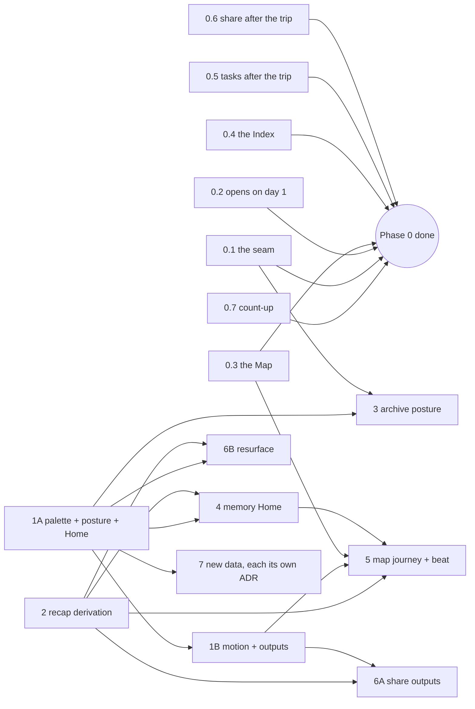

# A finished trip is a memory — the build plan (epic)

**Date:** 2026-09-25 · **Decision:** [ADR-0239](../decisions/0239-a-finished-trip-is-a-memory-not-a-plan.md) · **Investigation and spec:** [`2026-09-25-what-a-finished-trip-is-for.md`](2026-09-25-what-a-finished-trip-is-for.md) (the F-numbers and feature numbers below are that note's) · **Mockup:** `mockups/past-trip-v1.html` (owed, Phase 1)

Eight phases, numbered 0 to 7, of four kinds: **bug fixes** (0), **design** (1A, 1B), **shared logic** (2) and **build** (3–7). Each numbered item (`0.3`, `4.2`) is its own PR, reviewable alone. Numbers in brackets like _(spec 1a)_ point at the investigation's feature list. Every PR ends green on `pnpm typecheck`, `pnpm test`, `pnpm build` and `pnpm format` (after `pnpm install`). Every PR that touches a surface ends with a look at 360px in both themes on a finished trip: seed, then pin `waypoint:dev-now` past the trip's end, as the investigation did.

## What blocks what

| Phase                    | Kind   | Needs                        | Can run beside    |
| ------------------------ | ------ | ---------------------------- | ----------------- |
| **0** the trip knows     | fixes  | nothing                      | 1A, 2             |
| **1A** palette + posture | design | nothing                      | 0, 2              |
| **1B** motion + outputs  | design | 1A                           | 3, 4              |
| **2** recap derivation   | logic  | nothing                      | 0, 1A             |
| **3** archive posture    | build  | 0.1, 1A                      | 4, 1B, 6B         |
| **4** memory Home        | build  | 1A, 2                        | 3, 1B, 6B         |
| **5** map journey + beat | build  | 0.3, 1B, 2, 4 (the beat)     | 6A                |
| **6A** share outputs     | build  | 1B, 2                        | 5, 6B             |
| **6B** resurface         | build  | 1A, 2                        | 3, 4, 5, 6A       |
| **7** new data           | build  | 1A, plus each item's own ADR | anything after 1A |

**The critical path is 1A → 4 → 5.** Design is the long pole, so it starts today alongside the fixes and the derivation, and nothing in Phase 0 or 2 waits on it. Three lanes open immediately:

- **Lane A (frontend fixes):** 0.1 to 0.7 in parallel.
- **Lane B (design):** 1A.
- **Lane C (shared logic):** 2.

---

## Phase 0 — the trip knows it ended (bug fixes · ADR-0239 §1–§5)

No design needed. Each item's surfaces are otherwise untouched. **No item waits on 0.1:** `useMode().phase` already existed, so 0.2–0.6 read it directly, and 0.1 only moved the three screens still calling `tripPhase(...)` onto it. 0.7 needs nothing.

### 0.1 · The seam (§1)

Built · PR #872

- **Goal:** one phase, read everywhere.
- **Files:**
  - `state/mode-state.tsx`: already exposes `phase`. Add `isFinished` beside it only if three or more callers would otherwise compare strings.
  - `screens/PlanHome.tsx:164` and `screens/PlanDay.tsx:332,349` read `useMode().phase` in place of their own `tripPhase(...)`.
  - `state/trip-state.tsx:1078`: `defaultDay` computes the phase from the `tripToday` it already calls. It sits above `ModeProvider`, so it cannot read the context.
- **Tests:**
  - `mode.test.ts` holds the derivation already.
  - Add one spec that PlanHome and PlanDay agree with `useMode().phase` on a finished trip.
  - After this PR, `grep "tripPhase("` finds only `lib/mode.ts`, `state/mode-state.tsx` and `trip-state.tsx`.

### 0.2 · Where it opens (F1, F6 · §2, §3)

Built · PR #872

- **Files:**
  - `state/trip-state.tsx`: `defaultDay = trip.startDate` when finished. `daySelectTarget` keys on `defaultDay`, so `?day=` omission follows by itself.
  - `App.tsx:258-262,311`: no `hasEvents` gap marker when finished (pass `hasEvents: true`, or add a `finished` prop to `DayStrip`; prefer the prop so the strip states why).
  - `App.tsx:465`: the anchor drops its `יום N/M` readout. Its interim content is **nothing**; Phase 3 gives it words.
- **Tests:**
  - `trip-state` spec: a finished trip's Home and a bare `?tab=days` resolve to `startDate`.
  - `DayStrip` spec: no `.empty` on a finished trip.

### 0.3 · The Map (F2, F3, F4 · §2, §3)

Built · PR #871

- **Files:**
  - `screens/Map.tsx:329`: `setAllDays(phase === 'past')` in place of `false`.
  - `lib/place-usage.ts:838,848`: `placeBlock` and `comparePlacesBySchedule` take the phase, and a finished trip is one block, ascending.
  - `Map.tsx:766-779`: no location offer and no near-me when finished.
  - The locate control, `קרוב עכשיו` and each row's `ניווט` render nothing when finished. The row's trailing slot stays empty until Phase 5 gives it "open this day".
- **Tests:**
  - `place-usage.test.ts`: a finished trip orders day 1 first.
  - `Map.test.tsx`: opens at all days; no offer card; no `ניווט`.
  - An existing `e2e` Map spec pinned past the end.

### 0.4 · The Index (F7, F9 · §4)

Built · PR #869

- **Files:**
  - `ui/IndexBookingsView.tsx:103,139`: a finished trip shows every booking, open, chronological, with no `הצג מהעבר` fold.
  - `screens/Index.tsx:160-171`: the bookings tile names the count the trip had, not "none yet".
  - Every add entry the Index offers is absent when finished: bookings (`IndexBookingsView:257,285`), tasks (`IndexTasksView:336`), notes (`IndexNotesView:212`), and any document upload.
  - ADR-0049 §2's banner and wash are **not** built here. §6 replaces the wash, so they land in Phase 3.
- **Tests:** each view's spec gains a finished-trip case asserting no `.addbtn` and the full list.

### 0.5 · Tasks after the trip (F8 · §3)

Built · PR #870

- **Files:**
  - `lib/automatic-tasks.ts` / `lib/useAutomaticTasks.ts`: no readiness checks when finished.
  - `lib/tasks.ts:310,335`: `late` is false for a task whose `dueAt` is before the trip's end on a finished trip. It reads as never done, in neutral, not `--miss`.
  - A task due after the end keeps its urgency.
  - `screens/Index.tsx`: the tasks tile's `N באיחור` follows.
  - **Backend:** `notifications/kinds/trip-audience.ts:121-178`. `isLive` becomes "live, or this task falls due after the trip ended", so `task.due`, `task.digest` and `task.assigned` keep sending for post-trip deadlines.
- **Tests:**
  - `tasks.test.ts`: pre-end overdue is not `late` when finished, and post-end is unchanged.
  - `automatic-tasks.test.ts`: no checks when finished.
  - `trip-audience.spec.ts`: a post-trip deadline on an ended trip is notifiable; a pre-end one is not.
- **Docs:** ADR-0190 and ADR-0198 carry the one-line amendments this ADR names. Mark them built.
- **Merge note:** 0.4 and 0.5 both touch `Index.tsx`'s tile lines. Land 0.4 first or take both in one PR.

### 0.6 · Share after the trip (F10 · §5)

Built · PR #868

- **Files:**
  - `ui/ShareItinerarySheet.tsx:126`: the audience defaults to `READ` when finished. The join branch renders an ended-trip line (new Hebrew in `i18n/he.ts`, no em dash) and mints nothing.
  - `screens/TripSettings.tsx`: the invite section, likewise.
  - **Backend:** `trips/trips.service.ts:179` `getOrCreateInvite` throws the same `GoneException(INVITE_EXPIRED)` that `resolveActiveInvite` (`:418`) does, through the existing `tripHasEnded`.
- **Tests:**
  - `ShareItinerarySheet.test.tsx`: a finished trip opens on read and calls no `createInvite`.
  - `trips.service.spec.ts`: mint on an ended trip is 410.

### 0.7 · The count-up (F5)

Built · PR #867

- **Files:** `lib/useCountUp.ts:32`. Reset `playedFor` in the effect's cleanup, so a re-run after a cleared interval plays rather than returning at 0 (StrictMode, and any N → 0 → N target).
- **Tests:** a spec that mounts under `<StrictMode>` with motion wanted and asserts the final value is the target. Its sibling `PlanHome.count-up.test.tsx` does not run under StrictMode, which is why it missed this.

**Phase 0 is done when** the investigation's walk-through (seed, pin four days past the end, every tab at 360px) shows none of F1–F10. The `product/modes.md` past-trip section is then rewritten to what the app does.

**Done 2026-09-26** (PR #870, the last of the seven): the walk-through on main shows none of F1–F10, and `product/modes.md` is rewritten.

---

## Phase 1 — design (ADR-0239 §6–§8 · `design-mockups` skill · mockup first)

### 1A · The archive's palette and posture

Blocks 3, 4 and 6B. Starts today.

- **The palette** (owner: a whole new one), in both themes, validated for contrast. It must answer:
  - how `--ok`, teal and amber read inside it;
  - what a finished trip's chrome is (header, day strip, tab bar, the anchor's words from 0.2);
  - what replaces ADR-0049's banner and wash on the Index.
- **The memory Home:** the cover, the route strip, "by the numbers" (a variable set, never a fixed grid), the days as a contact sheet, firsts and bests, the stragglers card, the next-time list.
- **The day list as a record, not a builder:** Plan's archive rows lose the builder's dashed soft borders and oversized ✓.
- **`/trips`:** the past card with its cover (the `.is-past` dimming goes), the lifetime line, the anniversary card.
- **Output:**
  - `mockups/past-trip-v1.html` with measurements.
  - An ADR for the palette that amends ADR-0028, `design-language.md` and **root `CLAUDE.md` rule 4** (it gains the archive's hue).
  - An entry in `docs/design/mockups.md`.

### 1B · Motion and the outputs

Blocks 5 and 6A. Runs while 3 and 4 build.

- The map as a journey (the whole route in order, where we slept, pin outcomes) and the replay's pacing.
- The coming-home beat: a storyboard, its motion tokens, the reduced-motion skip.
- The trip book (fixed-light A4, beside the itinerary PDF), the group-chat card, and the anniversary push's copy.

---

## Phase 2 — the recap derivation (ADR-0239 §9 · `packages/shared` + two adapters · no UI)

Starts today. Needs nothing.

- **One pure function, `tripRecap(input)`,** in `packages/shared`. It computes:
  - the figures: days, nights and beds; places by category; kinds (`KIND`) and regions (`REGION`, `SERVED_CITY`); ground, foot and air distance; hours in the air; zones crossed;
  - the superlatives;
  - the stragglers (unresolved rows);
  - the next-time list (skipped rows plus unconsumed ideas);
  - the cover choice (`dayPhoto`'s rank across all days).
    Every figure is `absent | { value, estimate?, unresolved? }`, so "absent, not zero" is a type rather than a convention.
- **Two adapters, so every surface prints the same number:**
  - Client: snapshot plus `useTripRoutePack`.
  - Server: Prisma plus `RouteLeg`, for the narrative, book and card.
- **The decision owed here** (ADR-0239 _Consequences_): what a memory shows when its enrichment image has lapsed (a 180-day TTL). It is decided and written into this phase's PR before Phase 4 ships a cover. The candidates are:
  - a per-trip pin of the chosen cover's delivered image;
  - no refresh for places referenced only by finished trips;
  - accept the lapse and fall back to the next-ranked shot.
- **Tests:** table-driven over fixtures, one per figure, including the unresolved and absent arms. The seed trip is one fixture.

---

## Phase 3 — the archive posture (build · needs 0.1 and 1A)

The palette and chrome across every tab of a finished trip:

- the header anchor's words;
- the Index banner and its treatment (ADR-0049 §2's remainder);
- Plan's archive rows as a record;
- `/trips` past cards with their cover (the cover comes from 2; until 2 lands the card ships without one).

Updates `design-language.md` and marks the palette ADR built.

## Phase 4 — the memory Home (build · needs 1A and 2 · beside 3)

Replaces `PlanHome`'s past branch entirely. One PR per item; 4.1 lands first because every other item sits inside its frame.

- **4.1** The frame: cover, dates, faces, route strip and "by the numbers" _(spec 1a)_.
- **4.2** The days as a contact sheet _(spec 1b)_, on `DayHead` / `dayShot` / `fallbackDayTitle`.
- **4.3** Firsts and bests _(spec 1c)_.
- **4.4** The stragglers, one at a time _(spec 4a)_, on `SettleControl`'s `sheet` density walking the list.
- **4.5** The next-time list, read-only _(spec 5a, display half)_. Its "take to another trip" is Phase 7.
- **4.6** The notes as a journal _(spec 2b)_, read-only (§4).
- **4.7** Lists by kind _(spec 2c)_ and search as the page's first control _(spec 2a)_.

## Phase 5 — the map as a journey, and the beat (build · needs 0.3, 1B, 2; the beat also needs 4)

- **5.1** The journey drawing on `כל הימים` _(spec 1d)_. The row's trailing slot opens the day.
- **5.2** Replay _(spec 1e)_, on the camera's eased moves and `buildDayStopSequence`.
- **5.3** Coming home _(spec 1f, §7)_, remembered per device per trip the way `mode-seen` is.

## Phase 6 — share and resurface

Two sub-phases that can run in parallel with each other.

### 6A · Share outputs (needs 1B and 2's server adapter)

- **6A.1** The past-tense narrative _(spec 3b)_: a retrospective skill variant on the existing generator, over rows marked `היינו`, with the same allowlist and fallback.
- **6A.2** The trip book _(spec 3c)_: a second template on the PDF renderer.
- **6A.3** The group-chat card _(spec 3d)_: new work on the PDF's server-side browser, since ADR-0220's covers are static.
- **6A.4** A list share _(spec 3e)_, scoped to a category.

### 6B · Resurface (needs 1A and 2)

- **6B.1** The lifetime line on `/trips` _(spec 6b)_.
- **6B.2** The anniversary card on `/trips` _(spec 6a, in-app)_.
- **6B.3** The anniversary push (§8):
  - a new kind in `notifications/kinds/`;
  - `notifyMemories` beside `NOTIFY_PREF.TASKS` / `OBLIGATIONS` (a column and its settings toggle);
  - the ledger fire key carries the year.
    The copy comes from 1B; until then 6B.3 waits, and 6B.1 and 6B.2 do not.

## Phase 7 — new data, each behind its own ADR (needs 1A for somewhere to land)

In the order that spends the least for the most:

1. **Our photos, cheapest version:** an album link on the trip as a tile. No pipe, no new entity if a URL note suffices.
2. **Next time, across trips:** 4.5's list gains "take these to another trip's shelf", a cross-trip server write minting each place in the target trip (ADR-0048).
3. **Favourites:** a per-member reaction on a row or place, then the group's favourites and a "best meal" vote.
4. **The weather we had:** a historical-weather pipe keyed like the forecast cells (ADR-0004: a pipe, not a screen).
5. **Who did what:** an aggregate over the `Change` log's creates, kept non-competitive.
6. **Go again:** a new trip from this one's shape.

---

## Not in this epic

- The `day-swipe.spec.ts:355` e2e flake PR #866 hit (a swipe begun while the previous turn settles is lost). It has its own backlog line.
- Money figures, a GPS track, and a "memories" tab were rejected in the spec, with reasons.
