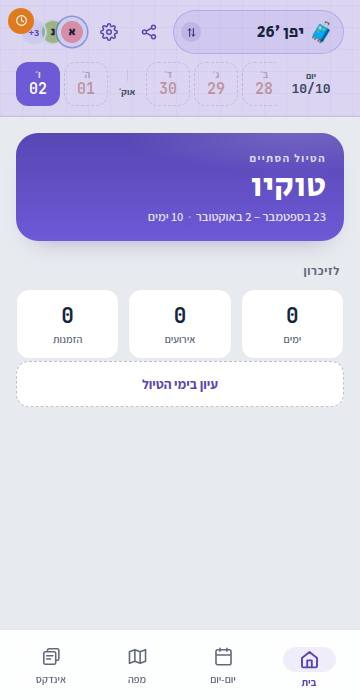
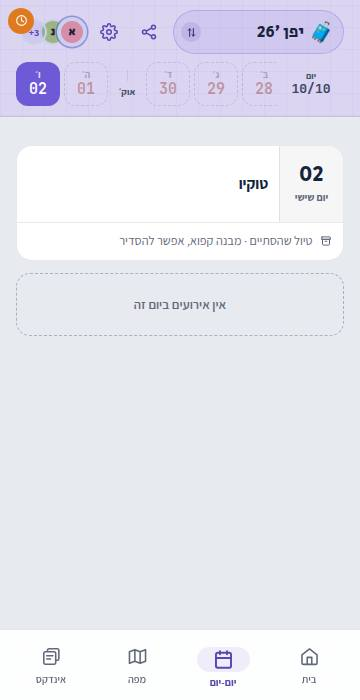
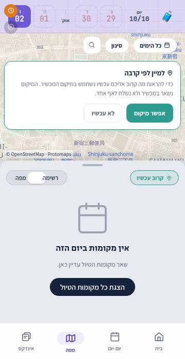
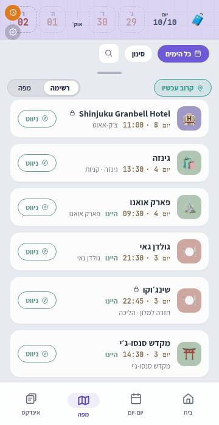
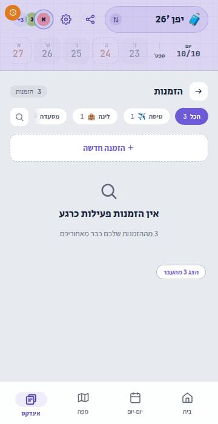
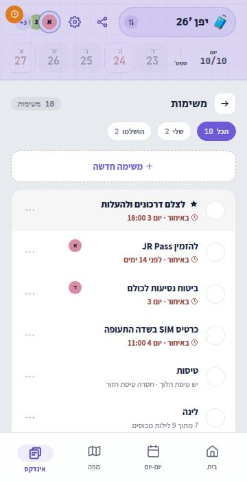
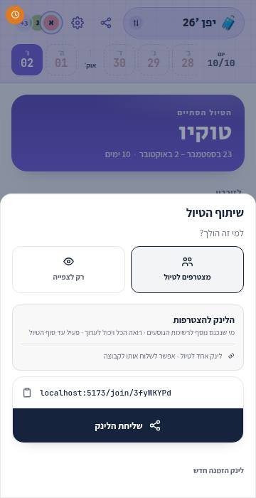

# 2026-09-25 — What a finished trip is for: an investigation and a spec

**The first of two sessions.** This note is the investigation and the feature spec. The design language of a past trip is the second session's, and nothing here is drawn or built yet. **Decisions this revisits:** [ADR-0040](../decisions/0040-trip-mode-access-window-and-past-trip-archive.md) (a finished trip is a calm archive, and its _Deferred_ paragraph is exactly this ask), [ADR-0044](../decisions/0044-settling-a-finished-trip.md) (settle-editable, and its presentation half was left open), [ADR-0049](../decisions/0049-index-tab-mode-and-lifecycle.md) §2 (the Index's archive state, decided and never built). **Backlog:** the _Archive presentation_ line, amended in place.

## The ask

> I want to discuss designing and expanding the past trip page. Right now it's very minimal - it becomes mostly read-only and it's very bare. I'd like to expand this, to add cool features like stats and whatnot. Things that people are going to want to go back to see and to remember. […] I also want to improve the visuality of it and to fix some bugs that were carried by ongoing trips (for example, it currently defaults to the last day because it's the closest, it makes more sense for it to be on the first day, or on all days on the map probably). […] Try to think outside the box.

## How this was looked at

The app was run, not only read: `DEV_AUTH=1`, the seeded Japan trip (`2026-09-23 → 2026-10-02`, 12 events, 3 bookings, 5 travelers), a few rows settled to `done`/`skipped` and one left unresolved so the trip looked lived-in, and the clock pinned to **`2026-10-06 12:00` Tokyo** (four days after it ended). Every tab at 360px and 390px, both themes. Then the code, for the mechanism behind each thing seen.

Two sandbox limits, so they are not reported as defects: no routing provider (every leg reads `מחשב מסלול…` forever) and no enrichment pass (no day photographs). Both work on the real deployment. The map's basemap did render.

## What a finished trip does today

| Home                                                                         | Days (as opened)                                                                 | Map (as opened)                                                             |
| ---------------------------------------------------------------------------- | -------------------------------------------------------------------------------- | --------------------------------------------------------------------------- |
|                          |      |  |
| **Map · כל הימים**                                                           | **Index · הזמנות**                                                               | **Index · משימות**                                                          |
|  |  |         |

**Share sheet** (F10): 

The Home is a violet prep hero reading `הטיול הסתיים · טוקיו`, three stat tiles under `לזיכרון`, and a dashed `עיון בימי הטיול` button (`PlanHome.tsx:164`). Everything below the fold is empty. The trip's other surfaces are the live trip's surfaces, unchanged, because they never learn it ended.

## Part A: bugs a finished trip inherits from a live one

**The root cause is one fact read in three places.** `ModeProvider` already derives the trip's phase and exposes it as `useMode().phase` (`state/mode-state.tsx:62`). Its **only** reader is the mode toggle (`App.tsx:171`). `PlanHome` and `PlanDay` each re-derive it with their own `tripPhase(...)` call, and no other surface asks at all. Counted: `tripPhase(` has three call sites outside `lib/mode.ts`, and nine of the ten defects below sit on surfaces that never ask it (F5 is a hook bug that happens to show on the Home). So the fix is not ten `if (past)` branches. It is one phase, read everywhere, with `defaultDay` the one exception (it lives in `TripProvider`, which sits above `ModeProvider`, so it derives the phase itself from the same `tripToday` it already calls).

| #   | What you see on a finished trip                                                                                                                                                                                                                    | Why                                                                                                                                                                                                                                                                                                                                                                 | Proposed                                                                                                                                                                                                       |
| --- | -------------------------------------------------------------------------------------------------------------------------------------------------------------------------------------------------------------------------------------------------- | ------------------------------------------------------------------------------------------------------------------------------------------------------------------------------------------------------------------------------------------------------------------------------------------------------------------------------------------------------------------- | -------------------------------------------------------------------------------------------------------------------------------------------------------------------------------------------------------------- |
| F1  | **Days opens on the last day**, which on the seed is empty: `אין אירועים ביום זה`. Home's header anchor reads the same day.                                                                                                                        | `defaultDay = clampDate(tripToday(…), start, end)` (`state/trip-state.tsx:1078`). After the end, "the day closest to today" is the last one.                                                                                                                                                                                                                        | Past → `trip.startDate`. The `?day=` omission rule (`daySelectTarget`) keys on `defaultDay`, so nothing else moves.                                                                                            |
| F2  | **The Map opens day-scoped on that same empty day**: `אין מקומות ביום הזה` over a map of one hotel.                                                                                                                                                | `useEffect(() => setAllDays(false), [mode, …])` (`screens/Map.tsx:329`) resets the scope on every mount.                                                                                                                                                                                                                                                            | Past → `setAllDays(true)`. "Where did we go" is a whole-trip question.                                                                                                                                         |
| F3  | **At `כל הימים` the list reads backwards**: the day-8 check-out first, the arrival airport last.                                                                                                                                                   | The list is two blocks, "coming up" then "behind you, **newest first**" (`Map.tsx:1004`, `comparePlacesBySchedule`/`placeBlock`). After the trip everything is behind you, so the whole list is the second block.                                                                                                                                                   | Past → one block, chronological, day 1 first.                                                                                                                                                                  |
| F4  | **The Map offers live-trip help**: a card asking to use your location `למיין לפי קרבה` on open, `קרוב עכשיו`, the locate button, and `ניווט` on every row. With permission already granted it silently requests a fix instead (`Map.tsx:766-779`). | None of these ask the phase.                                                                                                                                                                                                                                                                                                                                        | Past → no offer, no near-me, no `ניווט`. The row's trailing slot has a better occupant (Part D, 1d).                                                                                                           |
| F5  | **The Home tiles read `0 · 0 · 0`**, in both themes, on a trip with 10 days, 12 events and 3 bookings. The upcoming Iceland trip's tiles read 0 too.                                                                                               | `useCountUp`'s `playedFor` guard (`lib/useCountUp.ts:32`). StrictMode runs the effect, its cleanup (which clears the interval, value already 0), and the effect again, which returns early because `playedFor === target`. Reproduced under `pnpm dev`; a production build does not double-invoke, but the same guard sticks at 0 whenever a target goes N → 0 → N. | Reset the guard in the cleanup. Separately, the tiles themselves are wrong for a memory: `אירועים` counts the three booking-backed rows that `הזמנות` counts again, and `ימים` repeats the hero line above it. |
| F6  | **The header paints every empty day as a red dashed gap**, and the anchor reads `יום 10/10`.                                                                                                                                                       | Plan's "a gap to go fill" cue (`App.tsx:258-262`, `DayStrip`'s plan branch) and the live progress readout (`App.tsx:465`). Neither asks the phase.                                                                                                                                                                                                                  | Past → no gap marker, and an anchor that is not a progress bar. What it says instead is the design session's.                                                                                                  |
| F7  | **Index · bookings is empty on arrival**: `אין הזמנות פעילות כרגע`, then `הצג 3 מהעבר`. The tile above it says `3` beside `אין עדיין הזמנות`.                                                                                                      | The live trip's past/upcoming split (`IndexBookingsView.tsx:103,139`), and the tile subtitle only speaks about an upcoming booking (`screens/Index.tsx:160-171`). On a finished trip every booking is past, so the split hides all of them.                                                                                                                         | Past → the whole list, open, chronological. The tile names what the trip had.                                                                                                                                  |
| F8  | **Index · tasks shouts at a finished trip**: `להזמין JR Pass · באיחור · לפני 14 ימים` in red, and the readiness checks still open (`חסרה טיסת חזור`, `7 ימים ללא תוכנית`, `0 מתוך 5 העלו דרכון`). The tile says `4 באיחור`.                        | Nothing in `lib/tasks.ts`, `automatic-tasks` or the readiness derivation asks the phase.                                                                                                                                                                                                                                                                            | Past → the readiness checks retire, a pre-trip task that never got done reads neutral (not `--miss`), and **a task due after the trip stays live**. VAT refunds and insurance claims are real post-trip work.  |
| F9  | **Every Index list still offers to add**: `+ הזמנה חדשה`, `+ משימה חדשה`, `+ פתק חדש`.                                                                                                                                                             | ADR-0049 §2 decided the archive state (no add affordances, a `הטיול הסתיים · תצוגה בלבד` banner, the wash). It was never built: no Index file reads the phase.                                                                                                                                                                                                      | Build ADR-0049 §2, with one question back to it: notes (below).                                                                                                                                                |
| F10 | **The share sheet hands out a dead link.** It opens on `מצטרפים לטיול` and shows an invite captioned `פעיל עד סוף הטיול`, over a trip whose end has passed.                                                                                        | The sheet defaults to `AUDIENCE.JOIN` (`ui/ShareItinerarySheet.tsx:126`) and mints through `getOrCreateInvite` (`trips.service.ts:179`), which has no end check. The join route does: `resolveActiveInvite` answers **410 `INVITE_EXPIRED`** (`:418`). So the code is minted and then refused.                                                                      | Past → open on `רק לצפייה` (the public reader, which is the right post-trip audience), and the join branch says the trip is closed rather than offering a link. Trip settings' invite section, likewise.       |

**Checked and fine:** push notifications are gated on `audience.isLive` in every kind, so a finished trip sends nothing. `PlanDay` in read-only drops the free-slot chips, the add row and the shelf. Settling stays available, as ADR-0044 decided.

**Not a bug, a posture, and the design session's.** A finished trip wears Plan's violet chrome and the violet prep hero, and rule 4 gives violet to plan mode alone. The day list is the builder's: dashed "soft" borders and a large green ✓ on every row read as a working surface, not a record. On `/trips` a past trip is dimmed (`.is-past`), which reads as disabled rather than as a memory.

## Part B: what the page is for after the trip

The live app answers "what now". After the trip the question is "what was", and that splits into six jobs. Each feature below serves one of them, and a feature that serves none is not in this spec.

1. **Relive.** Take me back. Photo-led, chronological, calm.
2. **Recall.** "What was that ramen place?" "Which hotel in Kyoto?" A fact, fast, often asked by someone else.
3. **Share.** Send a friend our trip, or just our Tokyo food list.
4. **Close out.** Tidy the record: what we actually did, what we skipped. Finish the post-trip tasks.
5. **Reuse.** The ideas we never got to, and the trip as a template for the next one.
6. **Resurface.** A year later, bring it back.

## Part C: what the data can honestly say

ADR-0045's rule holds here as everywhere: **real data only, and a figure with no source is absent, not zero.** Every number below is derivable from what the trip already stores, offline, unless the row says otherwise. Two more rules follow from the record being the point (ADR-0043 §2):

- **A figure counts what was marked `היינו`**, and says so when rows are still unresolved (`12 מקומות · 2 לא סומנו`). Counting the plan would report a trip that didn't happen.
- **An estimate reads as one** (`~`): routed distances come from the leg cache, not from a GPS track, and ADR-0006 keeps it that way.

| Figure                                                                                                                     | Source                                                                                                                                                               | Today?                              |
| -------------------------------------------------------------------------------------------------------------------------- | -------------------------------------------------------------------------------------------------------------------------------------------------------------------- | ----------------------------------- |
| Days, nights, and how many beds (`9 לילות · 2 מלונות`)                                                                     | trip dates, lodging spans                                                                                                                                            | yes                                 |
| Places we went, by category (`8 אוכל · 5 אתרים · 2 טבע`)                                                                   | `EventStatus.done` × `EventCategory`                                                                                                                                 | yes                                 |
| **What they were** (`4 מפלים · 2 מקדשים · הר געש`)                                                                         | enrichment `KIND` (Wikidata P31), already stored for naming days                                                                                                     | yes, where enriched                 |
| Regions and cities                                                                                                         | enrichment `REGION` (P131), airports' `SERVED_CITY`                                                                                                                  | yes, where enriched                 |
| Distance on the ground, and on foot (`~146 ק״מ · ~23 ברגל`)                                                                | the day totals `DayTravelTotal` already prints, summed. The trip-wide offline `useTripRoutePack` already holds every leg                                             | yes                                 |
| Distance and hours in the air                                                                                              | `carriedBookingMeters` (great-circle), flight `startsAt`/`endsAt`                                                                                                    | yes                                 |
| Time zones crossed (`+6 שעות`)                                                                                             | `zoneCrossings`                                                                                                                                                      | yes                                 |
| Superlatives: the longest day, the earliest start, the latest night, the place we went twice, the best-rated place we went | stops, legs, `startsAt`/`endsAt`, `userRatingsTotal`/`rating`                                                                                                        | yes                                 |
| What we skipped, and the ideas we never got to                                                                             | `EventStatus.skipped`, unconsumed `MaybeItem`s                                                                                                                       | yes                                 |
| The group, and who did what (`דנה הוסיפה 14 מקומות`)                                                                       | `createdBy` on maybes/notes/tasks is on the client; events and bookings only carry `updatedBy`, so the honest count is the `Change` log's `create` rows, server-side | **needs a small read**              |
| A cover photograph for the trip                                                                                            | `dayPhoto`'s rank, taken across every day instead of one                                                                                                             | yes, with a durability caveat below |
| Money spent                                                                                                                | nothing stores a spend (ADR-0014 is display-only, and `Booking` has no cost column)                                                                                  | **no**                              |
| Weather we had                                                                                                             | forecasts expire and are not kept (ADR-0218)                                                                                                                         | **no**, would need an archive pipe  |
| Our own photos                                                                                                             | no pipe exists                                                                                                                                                       | **no**                              |

**The caveat that will bite: enrichment photographs expire.** `image` carries a 180-day TTL (`ENRICHMENT_FIELD_TTL_MS`). A trip is reopened a year later far more often than a place is re-enriched, so a memory page built on those photographs must decide what it shows when one has lapsed or been re-picked. That decision is owed before a cover photo ships.

## Part D: the feature spec

Grouped by job. **Reuses** names the infrastructure that already does most of the work, which is most of them; root rule 8 applies throughout. **New data** marks what would need an ADR of its own.

### 1 · Relive

- **1a · The trip, remembered (the Home, rebuilt).** Replaces the three tiles and the dashed button. Top to bottom: a cover (the trip's best-ranked shot, `dayPhoto` across all days) with the name, dates, and the group's faces. A route line of the cities in order, the reader's route strip. **By the numbers**, three to five figures from Part C chosen by what this trip actually has (a road trip leads with kilometres, a city break with places, a trip that flew far with zones crossed), never a fixed grid of zeros. Then the days.
  _Reuses:_ `dayPhoto`/`dayShot`, the reader's route strip, `DayTravelTotal`, `zoneCrossings`, `StatTile`.
- **1b · The days as a contact sheet.** Each day a card: its shot, its name (`fallbackDayTitle`, already shared with the reader), and three or four stops as marks. Tapping opens the day. This is what `עיון בימי הטיול` should have been.
  _Reuses:_ `DayHead`, `dayShot`, `fallbackDayTitle`.
- **1c · Firsts and bests.** Derived moments, not a leaderboard: the first thing we did, the last dinner, the longest drive, the place we went back to, the best-rated place we went. Each opens its row.
- **1d · The map as a journey.** At `כל הימים` on a finished trip: the whole route drawn in order, where we slept marked, and each pin's outcome (ADR-0137 already draws `היינו`/skipped on the pin). The row's trailing slot, freed from `ניווט`, opens the day it belongs to.
- **1e · Replay.** _(outside the box)_ A play button on that map: the camera flies the trip day by day, each day's stops lighting in order under its title, about two seconds a day. Everything it needs exists (the camera's eased moves, `buildDayStopSequence`, the day titles); what is new is only the sequencing. Reduced motion gets the static journey.
- **1f · Coming home.** _(outside the box)_ The mirror of ADR-0221's first morning. The first open after the trip ends plays a short tap-through of the trip's figures, one card at a time, then settles into 1a and never plays again on that device (remembered per trip, as `mode-seen` already is for the first morning). The trip began with a beat, and it can end with one.

### 2 · Recall

- **2a · Search the trip.** The Map's search already spans every place, and each Index list has its own. On a finished trip it becomes the page's primary control: "the ramen place" should be one query away from the Home.
- **2b · The notes as a journal.** Every note written on the trip, in day order, under the day and place it was written about. What we wrote down while there is the closest thing to a diary the app holds.
- **2c · Lists by kind.** Where we ate, where we slept, what we saw: a filtered, chronological list per category, each row carrying its day and its outcome. The Map's facets already filter this way; this is them as a reading surface.

### 3 · Share

- **3a · The share sheet opens on `רק לצפייה` after the trip** (F10). The public reader at Summary level is already the "inspire" rendering (ADR-0213) and is the right post-trip audience.
- **3b · Told in the past tense.** The narrative generator already writes a trip line and day lines over a Summary-safe allowlist, with a deterministic fallback and an input hash. A retrospective variant would be written only from rows marked `היינו`, in the past tense. Same pipe, same guards; the hash changes as the record is settled, which is the behaviour wanted.
- **3c · The trip book.** The A4 PDF renderer already exists (`itinerary-pdf.template.ts`, server-side browser). A memory layout (a cover, one page a day with its shot and stops, the figures at the back) is a second template on the same projection.
- **3d · A card for the group chat.** _(outside the box)_ One image, the cover with three figures on it, rendered by the same server-side browser the PDF uses. The group that took the trip is already in a WhatsApp chat, and that is where a trip gets remembered out loud. ADR-0220's link covers are the precedent for "the app speaking in someone else's app", but they are static PNGs cut by hand, so a per-trip card is new work on the PDF's renderer, not a reuse of theirs.
- **3e · Share a list, not the trip.** "Our Tokyo food list" to a friend going next month: a Summary share scoped to a category. The share policy's level and hash are the mechanism; the scope is new.

### 4 · Close out

- **4a · The stragglers, one at a time.** When rows are still unresolved, the Home's first card says so (`3 דברים לא סומנו`) and opens a sheet that asks one row at a time, `היינו` or `דילגנו`. `SettleControl`'s `sheet` density already is this question; the new part is walking the list. It is what makes every figure in Part C true.
- **4b · Tasks after the trip** (F8). The readiness checks retire; prep that never happened reads neutral; a task due after the trip is still a task. Worth a short line in ADR-0190 rather than a new ADR.

### 5 · Reuse

- **5a · Next time.** Skipped rows plus unused ideas become one list, `בפעם הבאה`, with one action: take them to another trip's shelf. The copy crosses trips, and `Place` is trip-scoped by design (ADR-0048, the schema's own comment), so each copied idea mints its place in the target trip. _New data:_ no, but a cross-trip write is a new server action.
- **5b · Go again.** A new trip made from this one: same days, shifted; soft rows copied as ideas, hard rows left behind (a booking is not a template). Heavier, and useful mainly to a group that returns somewhere.

### 6 · Resurface

- **6a · A year ago today.** On the anniversary, `/trips` shows the past trip as its cover with `לפני שנה בדיוק · מקדש סנסו-ג׳י`. **A push is a question, not a given:** ADR-0198's rule is that we notify what you can still miss, and a memory is not missable. In-app only unless the owner decides otherwise.
- **6b · A lifetime line on `/trips`.** Trips, days away, countries (`destinationCountryCode`). Small, and the first thing that makes the list feel like a record rather than a menu.
- **6c · Past trips as memories, not as disabled rows.** The `.is-past` dimming goes, and a past card carries its cover. The design session's.

### Needs new data, so each is an ADR of its own

- **Favourites.** A per-member ❤️ on a place or a row, then the group's favourites as a section, and a "best meal of the trip" vote as a small post-trip ritual. A new per-user reaction entity.
- **Our photos.** Cheapest honest version: an album link on the trip (a note with a URL already carries this) rendered as a tile, with no pipe at all. A real pipe is an integration by ADR-0004. As far as I know Google narrowed the Photos Library API's read scopes in 2025 and the Picker API is what remains for reading a person's photos; that needs checking before anyone designs against it.
- **Weather we had.** A historical-weather pipe (Open-Meteo has an archive endpoint), keyed like the forecast cells. Small, and nice beside a day's shot.
- **Who did what** (Part C). A read over the `Change` log's creates, aggregated per member. Worth doing only if it stays non-competitive.

### Rejected

- **Money figures.** Nothing records a spend, and inventing one would break ADR-0045. If spending ever becomes data it will be its own feature, and a retrospective will read it then.
- **Steps or a GPS track.** ADR-0006. The routed estimate is the honest version.
- **A separate "memories" tab.** Pipes, not screens (ADR-0004) is about integrations, but the same instinct applies: the finished trip is the same four tabs in a different posture, not a fifth.

## Part E: proposed build order

1. **Step 0: the bugs (Part A).** Mechanical, test-led, one PR. One phase, read everywhere; then F1–F10. No design needed except F6's anchor text, which can ship as "nothing" until the design session gives it words. This also discharges ADR-0049 §2's unbuilt archive state.
2. **Step 1: design language.** The second session, with a mockup (`mockups/past-trip-v1.html`, the file ADR-0040 said this would earn): the archive posture's chrome (is it violet?), 1a's Home, 1b's contact sheet, the day list as a record rather than a builder, the past card on `/trips`.
3. **Step 2: relive and close out.** 1a, 1b, 1c, 1d, 4a, 4b. All from existing data.
4. **Step 3: share and resurface.** 3a–3c, 6a, 6b, then 1e, 1f and 3d as the "wow" set.
5. **Step 4: new data.** Favourites, photos, weather, who-did-what, 5a/5b. Each behind its own ADR.

## Questions for the owner

1. **Default day:** Days opens on day 1 and the Map on `כל הימים`. Agreed?
2. **Chrome:** does a finished trip keep Plan's violet, or does the archive get a posture of its own? Rule 4 reads against violet here, since nothing is being planned. This is the design session's first question.
3. **Tasks after the trip (F8/4b):** retire the readiness checks, neutralise pre-trip overdue, keep post-trip-dated tasks live. Right split?
4. **Notes on a finished trip:** ADR-0049 freezes the Index, but a note written after the trip ("next time, book Ichiran ahead") is exactly the kind of thing worth keeping. Should notes stay writable, as settling does?
5. **The anniversary (6a):** in-app only, or is this the one push that earns an exception to ADR-0198?
6. **Coming home (1f):** do you want the one-time beat, or should the archive stay entirely calm, as ADR-0040 first imagined?

### The owner's answers (2026-09-25), decided in [ADR-0239](../decisions/0239-a-finished-trip-is-a-memory-not-a-plan.md)

1. Yes: day 1, and all days on the Map (§2).
2. _"We should maybe come up with a whole new color palette for past trips"_ (§6). Neither violet nor the past-day wash; designed in the epic's Phase 1A.
3. Yes (§3). A consequence written into §3: post-trip deadlines keep **notifying** too, which amends ADR-0198's "a past trip sends nothing".
4. No: notes are frozen with everything else (§4).
5. The owner leaned towards a push and asked for an opinion. The opinion is yes, fenced: once per trip per year, only when it can name a place marked `היינו`, its own preference, on by default (§8).
6. Yes: the coming-home beat (§7).

The epic's phases, and what blocks what: [`2026-09-25-a-finished-trip-is-a-memory-build-plan.md`](2026-09-25-a-finished-trip-is-a-memory-build-plan.md).
