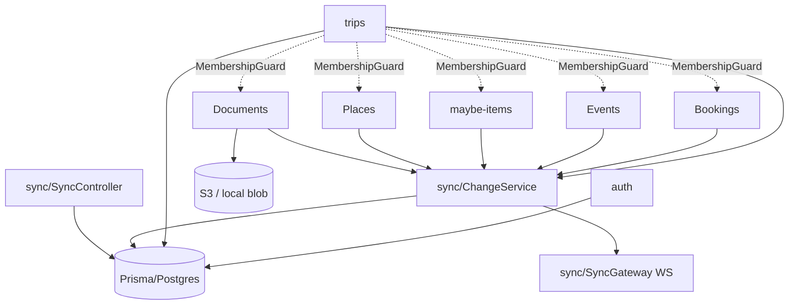
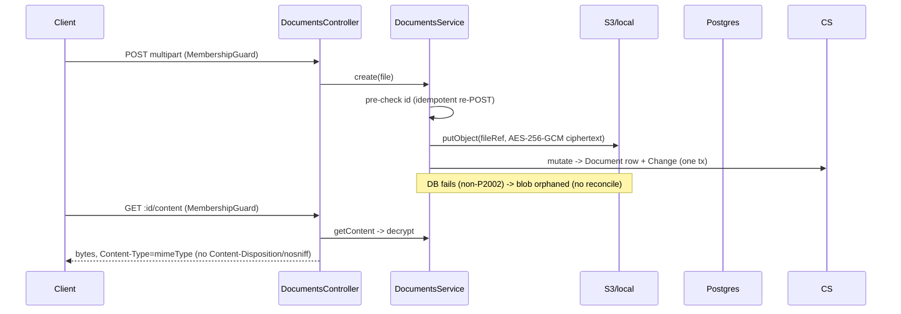

# Backend Architecture Review

**Status:** REVIEW (advisory). Author: senior backend architect (external review). Date: 2026-07-18.
**Scope:** the NestJS backend under `backend/`, evaluated as a production system against Waypoint's collaboration, authorization, sync, offline, and data-integrity requirements. Frontend (`frontend/`) and `packages/shared` were read where they define the backend's contract or retry/sync assumptions. No production code was modified; only this document was added.

> This review sampled the repository; it is not exhaustive. Findings are grounded in specific files/symbols and, where noted, in code that was actually executed. Everything not marked CONFIRMED is a risk or open question at the stated confidence.

---

## 1. Executive summary

**Overall health.** The backend is small, coherent, and unusually well-documented for its stage. Module boundaries map cleanly to the domain, mutations funnel through a single `ChangeService` choke point, authorization is applied consistently through one `MembershipGuard`, and there is a real Postgres integration test suite (113 tests, all green in this review). The team has clearly thought hard about offline retry-safety (client-generated ids + `P2002`-as-idempotent) and about not over-building (no CRDT, no queue, no premature microservices). These are the right instincts.

**Architectural maturity.** Mid-stage. The _shape_ is production-grade; several _cross-cutting guarantees_ the product depends on are not yet enforced end-to-end. The gaps cluster in exactly the areas the product leans on hardest: multi-writer synchronization consistency, membership revocation, and document handling.

**Strongest aspects (preserve these):** the `ChangeService` atomic-write-then-broadcast primitive; the single-guard authorization model with 404-not-403; client-id idempotency on every create; zod-as-single-source-of-truth for validation + OpenAPI; server-side hard/soft event guard; fail-loud storage misconfiguration.

**Most important weaknesses:** (1) the sync cursor (`Change.seq`) is **not a commit-consistent watermark**, so a client can advance past a concurrently-committed change and never receive it; (2) **membership removal does not evict a live WebSocket**, so a removed member keeps receiving the trip's live data; (3) documents are served **inline with a caller-controlled MIME type and no upload allow-list**, opening a same-origin script-execution path.

**Top three risks**

1. **B-01 (High, CONFIRMED):** Snapshot and catch-up can permanently skip a change committed concurrently — silent, per-client data divergence in the core collaboration loop. Empirically reproduced in this review.
2. **B-02 (High):** A removed member's open WS stream is never closed; they continue to receive every subsequent change to a trip they were removed from.
3. **B-03 (High):** A trip member can upload an HTML/SVG "document" that executes JavaScript in the app origin when another member opens it, enabling refresh-cookie → access-token theft (co-traveler account takeover).

**Production-readiness assessment.** **Not yet, for the collaboration guarantees the product markets — close for a single-writer / low-concurrency pilot.** The happy paths are solid and tested. The failure surface that a live, multi-person trip on flaky connectivity will actually hit — concurrent writes, reconnect-mid-write, membership revocation — is where the confirmed defects sit.

**Does the backend support the frontend's implied offline + collaboration guarantees?** _Partially._ Retry-safe mutation replay: **yes** (well-designed). Snapshot + incremental catch-up: **yes in shape, no in consistency** (B-01). Real-time fan-out: **yes, but leaks to removed members** (B-02). Conflict handling is honest row-level LWW as documented. The backend cannot today guarantee "everyone converges to the same trip state" under concurrency, which is the central collaboration promise.

---

## 2. Scope and methodology

**Files/modules reviewed (sample):** `main.ts`, `app.module.ts`; all of `auth/`, `trips/`, `bookings/`, `events/`, `maybe-items/`, `places/`, `documents/`, `sync/`, `common/`, `prisma/`, `health/`; `openapi-contract.spec.ts`; `prisma/schema.prisma` and all three migrations; `prisma/seed.mjs`; `packages/shared/src/{schemas,entities}.ts`; frontend `DocumentViewer.tsx`, `doc-cache.ts` (for the document-render contract).

**Documentation consulted:** `CLAUDE.md`, `docs/INDEX.md`, architecture docs (`sync-and-offline`, `collaboration-model`, `auth-and-google`, `api-contract`), and ADRs referenced inline (0005, 0011, 0012, 0015/0034, 0018, 0019, 0020, 0022, 0023, 0031, 0039, 0042, 0047/0048/0051, 0055/0056).

**Flows traced end-to-end:** new sign-in; session refresh; trip create; invite mint/preview/join; list/open trips; booking create/edit/delete (+ linked event); event create/move/status/delete; two-writer concurrency; offline reconnect + outbox replay; retry-after-no-response; `sinceSeq` catch-up; membership loss with cached data; document upload/download/replace/delete; expired/invalid session; cross-trip entity reference; trip deletion mid-flight.

**Commands run (this environment):**

- `pnpm install --frozen-lockfile` → OK.
- `pnpm --filter @waypoint/shared build`; `pnpm --filter @waypoint/backend typecheck` → **clean**.
- Local Postgres 16 initialized; `prisma migrate deploy` (all 3 migrations) + `seed.mjs` → OK.
- `pnpm --filter @waypoint/backend test` → **15 files, 113 tests, all passing** against real Postgres.
- A targeted concurrency probe (two connections) reproducing **B-01** — see that finding.

**Was Postgres used?** Yes (real, not SQLite/mock). **Object storage exercised?** No — the S3 path was read, not run; the local-disk fallback backs the tests. **Concurrency tested?** Only the single B-01 probe; broader interleavings were reasoned from code. **App executed?** Tests only; no full server boot / live WS session. **Could not verify:** S3/R2 behavior, real Google OAuth, live WebSocket fan-out under load, production env-var wiring, Railway deploy/rollback.

---

## 3. Product and architecture model

**Backend responsibilities.** One deployable NestJS process that: authenticates via Google OAuth and issues its own session (memory access JWT + rotating refresh cookie); owns all trip data in Postgres via Prisma; funnels every data-plane mutation through `ChangeService` (entity write + `Change` row in one transaction, WS broadcast post-commit); serves a snapshot + `sinceSeq` change feed + a WS stream for realtime; stores documents as AES-256-GCM blobs in S3-compatible storage with metadata in Postgres; and in production serves the built PWA on the same origin (single-origin, ADR-0020/0031).

### Module dependency (data plane routes through ChangeService/Prisma)



**Authentication flow.** `GET /auth/google` → Google consent (PKCE + `state` in a short-lived httpOnly cookie) → `GET /auth/google/callback` exchanges the code, fetches userinfo, upserts `User` (by email) + `AuthIdentity` (by provider+sub), issues a `Session` (random refresh token stored **hashed**), and sets an httpOnly `wp_refresh` cookie. `POST /auth/refresh` rotates the refresh token in place and returns a 15-min access JWT (hand-rolled HS256, `sub`+`email`, no authz claims). A global `JwtAuthGuard` requires a Bearer access JWT on every route not marked `@Public()`.

### Authenticated request flow

```mermaid
sequenceDiagram
  participant C as Client (PWA)
  participant G as JwtAuthGuard (global)
  participant M as MembershipGuard (trip routes)
  participant S as Service
  participant CS as ChangeService
  participant DB as Postgres
  participant WS as SyncGateway
  C->>G: Bearer access JWT
  G->>G: verify HS256 + exp (else 401; DEV_AUTH stub if no token)
  G->>M: req.user set
  M->>DB: findUnique Membership(tripId,userId)
  M-->>C: 404 if not a member
  M->>S: authorized
  S->>CS: mutate({apply, change})
  CS->>DB: $transaction(entity write + Change)
  CS->>WS: broadcast(change) after commit
  WS-->>C: {type:change, seq}
```

**Authorization model.** Two layers: `JwtAuthGuard` (authentication, default-deny) and `MembershipGuard` (per-request `Membership(tripId,userId)` lookup, 404 on miss). Admin-only operations (`assertAdmin`) are enforced in the service, not the guard. Object-level scoping is by `findFirst({ id, tripId })` in each service. Trip authorization is deliberately **not** in the token, so removal takes effect immediately for REST (but see B-02 for WS).

**Trip membership model.** Creator → `admin`; invitees → `peer`. Roles gate governance only (edit/promote/remove/delete); the collaborative timeline is open to all members. Last-admin-leaving auto-promotes the earliest-joined member. Invites are **stateless HMAC tokens** (no DB row), 7-day TTL, unrevocable per-link by design.

**Persistence model.** Prisma + Postgres; cuid ids (client may supply); `@db.Date` for calendar dates, `timestamp(3)` for instants; `Change.seq` is a `BIGSERIAL` cursor. Cascades from `Trip`/`User` clean up children.

### Offline mutation + sync

```mermaid
sequenceDiagram
  participant O as Outbox (IndexedDB)
  participant C as Client
  participant API as REST
  participant CS as ChangeService
  participant WS as Stream
  Note over C: offline edit -> client id + optimistic apply -> outbox
  C-->>O: enqueue (FIFO)
  Note over C: reconnect
  O->>API: replay FIFO (re-POST same ids)
  API->>CS: create; P2002 -> "already applied" (idempotent)
  C->>API: GET /snapshot (baseline + latestSeq)  OR  GET /changes?sinceSeq
  API-->>C: state (+cursor)
  WS-->>C: live changes (gap-detect on seq)
```

**Document upload/download.**



**Deployment topology.** Single Docker image on Railway: PWA + API + WS on one origin. `preDeployCommand: prisma migrate deploy`; `healthcheckPath: /health`; restart on failure. Postgres + S3-compatible storage as managed dependencies; Redis is present in compose for future v1.1 jobs only.

---

## 4. Domain and data model

**Main entities & ownership.** `User` (global) → `AuthIdentity`, `Session`. `Trip` (root aggregate) owns `Membership`, `Event`, `Booking`, `Place`, `Document`, `MaybeItem`, `Change`. `Event ⇄ Booking` is a strict optional 1:1 (`Event.bookingId @unique`). `Place` is a trip-scoped location registry referenced by `Event`, `Booking` (place / from / to), `MaybeItem`. `CalendarEventLink` maps `(event,user)` → Google event.

**Key invariants and where they live**

| Invariant                                      | DB-enforced?                   | App-enforced?                                                                           | Gap                  |
| ---------------------------------------------- | ------------------------------ | --------------------------------------------------------------------------------------- | -------------------- |
| One membership per (trip,user)                 | ✅ `@@unique([tripId,userId])` | upsert on join                                                                          | —                    |
| One external identity per (provider,account)   | ✅ `@@unique`                  | upsert                                                                                  | —                    |
| Event↔Booking 1:1                              | ✅ `Event.bookingId @unique`   | service                                                                                 | —                    |
| A child belongs to the same trip as its parent | ❌                             | ✅ for bookings (`assertPlacesInTrip`); ❌ for **events** (placeId/bookingId unchecked) | **B-06**             |
| Trip always has an admin                       | ❌                             | ✅ `ensureAdminExists` (racy)                                                           | B-09 note            |
| Unique invite codes                            | n/a (stateless)                | HMAC                                                                                    | not revocable (B-07) |
| Valid ordering (`sortOrder`)                   | ❌ (default 0)                 | client-supplied                                                                         | low                  |
| Monotonic sync cursor visibility               | ❌ (BIGSERIAL ≠ commit order)  | ❌                                                                                      | **B-01**             |
| `date`/`timezone` well-formed                  | ❌                             | ❌ (zod is `z.string()`)                                                                | B-05                 |
| Document `ownerUserId` is a member             | ❌                             | ❌                                                                                      | B-13                 |

**Deletion behavior.** `Trip` and `User` deletes cascade to children (good). `Booking` delete `SetNull`s `Event.bookingId` at the DB level, but the service prefers an explicit `event:update` Change so peers learn of the unlink (good). There is **no `Place` delete endpoint** (orphans intentionally left, documented). `Change` rows cascade with the trip, which is why trip-delete uses an _ephemeral_ broadcast (no durable log to write) — a clean, deliberate design.

**Sync metadata.** `Change(seq BIGSERIAL, before, after, actorUserId, action)` + `updatedAt`/`updatedBy` on entities. This is enough for LWW + undo + an audit feed, as documented — the weakness is the _visibility semantics_ of `seq`, not the columns.

**Invariants with no reliable enforcement:** cross-trip child references (B-06), sync-cursor consistency (B-01), date/timezone well-formedness (B-05), and "removed members stop receiving changes immediately" (B-02, contradicted by the WS path).

---

## 5. Authorization matrix

Enforcement legend: **JAG** = global JwtAuthGuard; **MG** = MembershipGuard; **admin** = `assertAdmin` in service; **scope** = service `findFirst({id,tripId})`.

| Resource   | Operation        | Required      | Enforced at                            | DB scoping           | Tests   | Main risk                                            |
| ---------- | ---------------- | ------------- | -------------------------------------- | -------------------- | ------- | ---------------------------------------------------- |
| Trip       | create           | auth<br>(JAG) | JAG                                    | —                    | ✅      | —                                                    |
| Trip       | list             | member        | JAG + `where memberships.some(userId)` | ✅                   | ✅      | missing `Membership(userId)` index (B-09)            |
| Trip       | read/snapshot    | member        | JAG+MG                                 | ✅                   | ✅      | snapshot consistency (B-01)                          |
| Trip       | update/delete    | admin         | JAG+MG+admin                           | ✅                   | ✅      | —                                                    |
| Membership | join             | valid invite  | JAG + HMAC                             | ✅                   | ✅      | join deleted trip → 500; rejoin after removal (B-07) |
| Membership | prefs (me)       | self          | JAG+MG                                 | ✅ (`tripId_userId`) | partial | —                                                    |
| Membership | set role         | admin         | JAG+MG+admin                           | ✅                   | ✅      | —                                                    |
| Membership | remove           | admin or self | JAG+MG(+admin)                         | ✅                   | ✅      | WS not evicted (B-02); ensureAdmin race              |
| Invite     | preview          | **public**    | `@Public` + HMAC                       | n/a                  | partial | no rate limit (B-10)                                 |
| Booking    | CRUD             | member        | JAG+MG+scope                           | ✅                   | ✅      | —                                                    |
| Event      | CRUD/move/status | member        | JAG+MG+scope                           | ✅                   | ✅      | client `bookingId`/`placeId` unchecked (B-06)        |
| Maybe-item | CRUD/consume     | member        | JAG+MG+scope                           | ✅                   | ✅      | —                                                    |
| Place      | create/update    | member        | JAG+MG+scope                           | ✅                   | ✅      | —                                                    |
| Document   | list/CRUD        | member        | JAG+MG+scope                           | ✅                   | ✅      | inline render / MIME (B-03)                          |
| Document   | content          | member        | JAG+MG+scope                           | ✅                   | ✅      | no Content-Disposition/nosniff (B-03)                |
| Sync       | changes/stream   | member        | MG (REST) / upgrade check (WS)         | ✅                   | ✅      | WS not re-checked after removal (B-02)               |

**Object-level authorization is genuinely good**: every trip-scoped service resolves entities by `findFirst({ id, tripId })`, so an IDOR against another trip's booking/event/document returns 404. The two holes are (a) _references_ written into events aren't trip-scoped (B-06), and (b) the _WebSocket_ is authorized once at upgrade and never re-checked (B-02).

---

## 6. Synchronization assessment

**Change representation.** Every data-plane mutation writes exactly one `Change` (or several via `mutateMany`) in the same transaction as the entity, then broadcasts post-commit. Deletions are represented (`action:delete` + `before`). Control-plane trip/roster mutations were promoted onto the data plane (ADR-0039), so they also produce Changes — good.

**Cursor semantics.** `Change.seq` (`BIGSERIAL`), per-trip, exposed as a string. Clients track `lastSeq`; gap = `incoming.seq > lastSeq+1` → run `GET /changes?sinceSeq=lastSeq`. Snapshot returns `latestSeq`.

**The core problem (B-01): `seq` is allocated at INSERT, not at COMMIT, and reads run at READ COMMITTED.** A higher `seq` can become visible before a lower `seq` commits. Consequences, both confirmed by tracing and one by execution:

- **Snapshot skip (reproduced):** `getSnapshot` reads entity lists _first_ and `latestSeq` _last_ inside a sequential `$transaction`. A change committing between those reads makes `latestSeq` include a change whose entity row is absent from the same snapshot. The client sets `lastSeq` past it and never catches up. _Probe result: snapshot returned 8 events (injected row absent) with `latestSeq=101` that already counted the injected change._
- **Catch-up skip:** a client that gap-detects on `seq=N+2` and runs `GET /changes?sinceSeq` while `seq=N+1`'s transaction is still uncommitted receives only `N+2`, advances its cursor, and later ignores the `N+1` broadcast as stale.

**Ordering guarantees.** Broadcast order = commit order, which ≠ `seq` order under concurrency. Out-of-order frames merely trigger extra catch-ups (tolerable) — the data-loss is the cursor advancing past an uncommitted lower `seq`.

**Retry / idempotency.** Excellent. Client-generated ids + `P2002`-as-already-applied make every `create` retry-safe; `consume`/status are naturally idempotent; unlink/update are LWW-idempotent. No temp-id→real-id swap.

**Conflict handling.** Row-level, server-authoritative LWW, exactly as documented. No field-level merge (accepted). Hard events are confirm-gated. No silent cross-writer _loss_ beyond the documented same-row LWW — except B-01, which is a _consistency_ bug, not a conflict-policy choice.

**Permission-change behavior.** REST honors removal immediately; **WS does not (B-02)**.

**Cross-trip isolation in sync.** Snapshot/changes/broadcast are all per-`tripId` and membership-checked (REST) — a client cannot pull another trip's feed via these endpoints.

**Old-client compatibility.** Additive-only so far; the one destructive migration (dropping `Booking.address/startsAt/endsAt`, `Event.location`, `TripNote`) would break an old client mid-rolling-deploy (B-08 note).

**Classification (evidence-based):**

| Capability                  | Supported?                | Evidence                                   |
| --------------------------- | ------------------------- | ------------------------------------------ |
| Snapshot synchronization    | ✅ shape / ⚠️ consistency | `getSnapshot` one-txn baseline, but B-01   |
| Incremental synchronization | ✅ shape / ⚠️ consistency | `sinceSeq` feed, but B-01                  |
| Retry-safe mutations        | ✅                        | client ids + P2002 recovery                |
| Offline mutation replay     | ✅                        | FIFO outbox; server idempotent             |
| Conflict detection          | ⚠️ partial                | LWW + change feed; no version/precondition |
| Conflict resolution         | ✅ (LWW, by policy)       | `updatedAt` last-writer-wins               |
| Eventual synchronization    | ❌ **not guaranteed**     | B-01 breaks convergence under concurrency  |
| Real-time collaboration     | ⚠️                        | works, but leaks to removed members (B-02) |

Do **not** describe the system as "eventually consistent" until B-01 is fixed: a client can reach a stable state that is permanently missing a change with no self-healing short of a manual full reload.

---

## 7. Transaction and consistency matrix

| Operation               | DB writes                                      | External side effects | Tx boundary                                     | Idempotent             | Concurrency protection   | Partial-failure                                          | Recovery                | Main risk                                                |
| ----------------------- | ---------------------------------------------- | --------------------- | ----------------------------------------------- | ---------------------- | ------------------------ | -------------------------------------------------------- | ----------------------- | -------------------------------------------------------- |
| User provisioning       | User + AuthIdentity upsert                     | Google token exchange | **none (2 separate upserts)**                   | by email/sub           | unique constraints       | identity upsert can fail after user upsert               | re-login re-upserts     | email-change re-points identity, orphans old user (B-12) |
| Trip create             | Trip + Membership                              | —                     | ✅ `$transaction`                               | no (server id)         | —                        | atomic                                                   | —                       | —                                                        |
| Trip join               | Membership upsert                              | —                     | single stmt                                     | ✅                     | `@@unique`               | —                                                        | —                       | FK 500 if trip deleted; rejoin-after-removal (B-07)      |
| Member remove           | Membership delete + Change (+ maybe promote)   | WS broadcast          | ✅ per mutate; **promote is a separate mutate** | ✅                     | none on ensureAdmin read | two concurrent admin removals can both skip/both promote | manual                  | racy last-admin (B-09)                                   |
| Booking create (+event) | Booking (+Event) + 1–2 Change                  | WS                    | ✅ `mutateMany`                                 | ✅ (P2002)             | id unique                | rollback all                                             | re-POST                 | —                                                        |
| Booking delete/unlink   | Event update/delete + Booking delete + Changes | WS                    | ✅ `mutateMany`                                 | ✅                     | —                        | rollback all                                             | —                       | —                                                        |
| Event mutations         | Event + Change                                 | WS + ripple compute   | ✅                                              | ✅ create              | none                     | rollback                                                 | —                       | ripple is read-only suggestion (safe)                    |
| Maybe-item              | MaybeItem + Change                             | WS                    | ✅                                              | ✅                     | —                        | rollback                                                 | —                       | —                                                        |
| Document upload         | put blob → Document + Change                   | **S3 then DB**        | DB tx only; **blob is pre-tx**                  | ✅ (pre-check + P2002) | id unique                | **non-P2002 DB failure orphans blob**                    | none (no reconcile job) | orphan ciphertext (B-13/Low)                             |
| Document replace        | put new blob → update row → delete old blob    | S3 ×2                 | DB tx; blobs outside                            | ✅                     | —                        | mid-flight failure orphans new blob                      | none                    | orphan blob                                              |
| Document delete         | delete row + Change → delete blob              | S3                    | DB tx; blob after                               | ✅                     | —                        | row gone, blob delete best-effort                        | none                    | orphan blob if S3 delete fails                           |
| Sync change record      | (folded into every mutate)                     | WS                    | ✅                                              | —                      | —                        | —                                                        | —                       | **B-01 visibility**                                      |

The multi-system document workflow is **not atomic and has no reconciliation** — correctly, the code biases toward "orphan a blob rather than lose a document," but there is no sweeper for orphans and no alarm. Acceptable at current scale; note it (B-13).

---

## 8. Findings

Severity: Critical / High / Medium / Low / Informational. Confidence: CONFIRMED / High / Medium / Low. Scope: S / M / L.

### High

---

**B-01 — Sync cursor (`Change.seq`) is not a commit-consistent watermark; snapshots and catch-up can permanently skip concurrent changes**
Severity: **High** · Confidence: **CONFIRMED (reproduced)** · Category: sync-consistency · Scope: M
Affected: `trips/trips.service.ts` `getSnapshot()`; `sync/change.service.ts` `mutate()/mutateMany()`; `sync/sync.controller.ts` `list()`; `sync/sync.gateway.ts` `latestSeq()`; `Change.seq BIGSERIAL`.

_Observed._ `seq` is assigned at row INSERT (`BIGSERIAL`), but Postgres sequences do not guarantee that a lower `seq` becomes visible before a higher one — commit order is independent of allocation order. All reads run at READ COMMITTED. `getSnapshot` reads entity lists first and `latestSeq` last within one sequential `$transaction`.

_Why it matters._ This is the central collaboration loop. A client can advance `lastSeq` past a change it never received and never self-heal (no gap below the cursor is ever re-examined).

_Realistic scenario._ Two members edit during a busy planning session. Writer A's transaction (`seq=41`) is briefly slower to commit than Writer B's (`seq=42`). A third member either (a) loads a snapshot in that window — gets state without A's change but `latestSeq=42`; or (b) receives B's `seq=42` broadcast, catches up while `41` is uncommitted, advances to `42`, then discards `41` as stale. Either way A's change is invisible on that device until a manual full reload.

_Evidence (probe, this review)._ A two-connection probe mirroring `getSnapshot`'s read order returned `eventCount:8, injectedVisibleInEvents:false, latestSeq:"101"` while the true post-commit count was 9 — i.e. the snapshot's cursor already counted a change whose entity it omitted.

_Recommended change._ Two independent fixes, both cheap:

1. **Snapshot order+isolation:** read `latestSeq` _first_, entities _after_ (so a worst-case cursor is stale-_low_ and the client harmlessly re-applies via `/changes`), and/or run `getSnapshot` at `Serializable`/`RepeatableRead` isolation (`$transaction(fn, { isolationLevel })`).
2. **Catch-up watermark:** have `/changes` and the gap-detector only advance the cursor across a _contiguous, fully-committed_ prefix — e.g. don't return/emit a `seq` until all lower `seq` for the trip are committed (a "stable high-water mark"), or gate reads behind a short commit-visibility lag, or allocate `seq` inside the mutate transaction via a per-trip counter row (`UPDATE ... RETURNING`) so `seq` order = commit order.
   _Suggested priority:_ immediate.
   _Regression tests:_ the two-connection interleaving above (snapshot omits row but not cursor); a catch-up test that injects an uncommitted lower `seq` and asserts the client cursor does not skip it.

---

**B-02 — Membership removal does not evict the removed member's live WebSocket; they keep receiving the trip's changes**
Severity: **High** · Confidence: **High** · Category: authorization / data-isolation · Scope: S–M
Affected: `sync/sync.gateway.ts` (`channels` map, no eviction API); `trips/trips.service.ts` `removeMember()`.

_Observed._ WS membership is checked once at upgrade (`handleUpgrade`). `removeMember` deletes the `Membership` and broadcasts a `membership:delete` change **to the same channel that still contains the removed member's socket**. Nothing closes that socket or drops it from `channels`. There is no server-side eviction path.

_Why it matters._ Directly contradicts the documented guarantee ("removed users stop receiving changes immediately", `sync-and-offline.md`) and the whole rationale for keeping trip authz out of the token. REST is correctly gated; the realtime plane is not.

_Realistic scenario._ An admin removes a member during a trip (e.g. after a falling-out). That member's app keeps its stream open; every subsequent booking, document metadata, code, and place edit continues to arrive on their device in real time. A motivated ex-member simply keeps the tab open.

_Evidence._ `SyncGateway` exposes only `broadcast`/`broadcastPresence`; the client `close` handler is the _only_ thing that removes a socket. `removeMember` never calls into the gateway to disconnect.

_Recommended change._ Add `SyncGateway.disconnectUser(tripId, userId)` that closes matching sockets and prunes `channels`; call it from `removeMember` (and on `deleteTrip`). Optionally re-verify membership on a periodic WS heartbeat as defense-in-depth.
_Priority:_ immediate. _Tests:_ connect as member, remove them, assert socket closed and no further frames delivered.

---

**B-03 — Documents are served inline with a caller-controlled MIME type and no upload allow-list → same-origin script execution / token theft**
Severity: **High** (Critical-adjacent) · Confidence: **High** · Category: file-security / stored-XSS · Scope: M
Affected: `documents/documents.controller.ts` `getContent()` (sets `Content-Type: mimeType`, no `Content-Disposition`, no `X-Content-Type-Options`); `documents/documents.service.ts` `create()` (no MIME/extension validation); `packages/shared` `createDocumentSchema` (no file-type constraint); frontend `ui/DocumentViewer.tsx` (non-image types opened via a `blob:` URL in a new tab).

_Observed._ Any member can upload a file with an arbitrary MIME type (e.g. `text/html`, `image/svg+xml`). On download the server echoes that type inline. The PWA renders images in `` (safe) but for other types creates a `blob:` object URL and offers "open in new tab". A `blob:` document inherits the app's origin.

_Why it matters._ An HTML/SVG "document" opened by a co-traveler executes JavaScript **in the Waypoint origin**. Because the refresh cookie is httpOnly + same-origin, that script can `fetch('/auth/refresh')` to mint an access token and then drive the entire API **as the victim** — across _all_ their trips, not just the shared one. Trips are invite-only (semi-trusted), but "one member can take over another member's account" is a serious escalation.

_Realistic scenario._ Member uploads `itinerary.html` (type `text/html`). A peer opens it from the Index; the tab runs attacker script, refreshes a token, exfiltrates the victim's other trips' documents/codes.

_Evidence._ `getContent` sends only `res.setHeader('Content-Type', mimeType); res.send(buffer)`. No allow-list anywhere between the multipart body and `putObject`.

_Recommended change._ (1) On `/content`, always send `Content-Disposition: attachment; filename="<sanitized>"` and `X-Content-Type-Options: nosniff` (the viewer can still fetch+preview images as blobs). (2) Enforce a server-side MIME allow-list on upload (pdf, common images, maybe office types) and reject `text/html`/`image/svg+xml`/`application/xhtml+xml`. (3) Frontend: never open non-image types inline; download only. (4) Consider a restrictive `Content-Security-Policy` on the app response as defense-in-depth.
_Priority:_ immediate. _Tests:_ upload `text/html`, assert 4xx (allow-list) or that `/content` responds with `attachment` + `nosniff`.

### Medium

---

**B-04 — No fail-fast configuration validation; `DEV_AUTH` has no production guardrail**
Severity: **Medium** · Confidence: **High** · Category: config / security-hardening · Scope: S
Affected: `common/env.ts` (`requireEnv` throws lazily at first use); `auth/jwt-auth.guard.ts` + `sync/sync.gateway.ts` (`DEV_AUTH === '1'` with no `NODE_ENV` check); `main.ts` (no startup validation).

_Observed._ Critical secrets (`JWT_SECRET`, `DOC_ENCRYPTION_KEY`, `TOKEN_ENCRYPTION_KEY`, `GOOGLE_*`, `S3_*`) are validated only when first touched by a request. `DEV_AUTH=1` turns any un-tokened request into the seeded dev user with no guard preventing it in production.

_Why it matters._ A misconfigured production deploy boots "healthy" (health check passes) and only fails at the first login/upload. Worse, an accidental `DEV_AUTH=1` in production is a **latent full authentication bypass** — the storage layer got a fail-loud guard (`storageBucket()` throws in production) but auth did not.

_Recommended change._ Add a startup config validator (a small zod schema over `process.env`, invoked in `bootstrap()` before `listen`): assert presence + base64-32-byte decoding of the keys, valid URLs, and **refuse to start if `DEV_AUTH` is set while `NODE_ENV==='production'`**. Fail fast, log which var is wrong (never its value).
_Priority:_ near-term (do with B-03). _Tests:_ boot with a missing/short key → process exits non-zero; `DEV_AUTH=1` + production → refuses.

---

**B-05 — Inconsistent error envelope + no domain-level input validation on dates/timezone → 500s for client-fixable errors**
Severity: **Medium** · Confidence: **High** · Category: api-contract / error-handling · Scope: M
Affected: no global exception filter (`main.ts` registers only `SpaFallbackFilter`); `common/zod-validation.pipe.ts` and service `ConflictException`s emit `{error:{code,message,details}}`, but `MembershipGuard`/`NotFoundException`/uncaught Prisma errors emit Nest's default `{statusCode,message,error}`; `packages/shared/schemas.ts` types `date`/`startsAt`/`endsAt`/`timezone` as bare `z.string()`.

_Observed._ The documented contract (`api-contract.md`) is `{ error: { code, message, details? } }`, but only _some_ paths produce it. And `date: z.string()` accepts `"banana"`; `new Date("banana")` → Invalid Date → Prisma write error → **500**. A bad `timezone` string later throws `RangeError` inside `Intl.DateTimeFormat` in `assertValidMoveTarget` → 500 on every nudge.

_Why it matters._ The frontend can't reliably branch on error shape (auth vs access vs validation vs conflict vs retryable), and malformed-but-client-fixable input surfaces as an opaque 500 instead of a 400 with a code. This undermines the offline outbox, which needs to distinguish "permanent 4xx, drop" from "retryable 5xx, keep".

_Recommended change._ (1) Register a global `AllExceptionsFilter` that maps every error to the documented envelope and maps known Prisma codes (`P2002`→409, `P2025`→404, `P2003`→409/400) to stable codes without leaking messages. (2) Tighten the shared schemas: `date` as `YYYY-MM-DD` regex, `startsAt/endsAt` as ISO-datetime, `timezone` validated against a known IANA set (or `Intl.supportedValuesOf('timeZone')`).
_Priority:_ near-term. _Tests:_ POST event with `date:"x"` → 400 `VALIDATION_ERROR`; a guarded 404 returns the same envelope shape as a validation 400.

---

**B-06 — Event mutations trust client-supplied `bookingId`/`placeId` without trip-scoping → cross-trip references and broken 1:1/hard-guard invariants**
Severity: **Medium** · Confidence: **High** · Category: data-isolation / integrity · Scope: S
Affected: `events/events.service.ts` `create()`/`update()` (write `input.bookingId`/`input.placeId` directly); contrast `bookings/bookings.service.ts` which _does_ `assertPlacesInTrip`.

_Observed._ Bookings validate that referenced places belong to the trip; events do not validate either `placeId` or `bookingId`. The FK only requires the target row to exist _anywhere_.

_Why it matters._ A member of trip A can create/patch an event whose `bookingId` points at trip B's booking (satisfying the global `@unique` if unlinked) or whose `placeId` points at trip B's place. This corrupts the Event↔Booking 1:1 across trips, and a hard event linked cross-trip escapes `assertNoHardEventDependency` (which filters by `tripId`). It's an integrity/isolation violation even though it isn't a direct read of B's data (the snapshot doesn't join the foreign row).

_Recommended change._ In `events.service`, validate `bookingId` via `findFirst({ id, tripId })` and reuse a place-in-trip check (extract the bookings helper into a shared util). Reject cross-trip references with 400.
_Priority:_ near-term. _Tests:_ create event in trip A referencing trip B's booking/place → 400.

---

**B-07 — Membership removal is not enforceable against a live invite link; stateless invites can't be revoked and a removed member rejoins instantly**
Severity: **Medium** · Confidence: **High** · Category: invite-security / membership · Scope: M (design)
Affected: `trips/trips.service.ts` `joinByToken()` (`upsert` re-creates a `peer` row), `verifyInviteToken()` (non-timing-safe `!==` HMAC compare; no trip-existence check → FK 500 on a deleted trip); `auth-and-google.md` claims removal is the per-member control.

_Observed._ Invites are stateless HMAC tokens with a 7-day TTL and **no per-link/per-member record**. Removing a member deletes their `Membership`, but any still-valid invite link (they may hold their own, or reuse a shared one) lets them re-`join` immediately as a peer. The documented "immediate per-member control = removal" is therefore only true until the next join. The only true revocation is rotating `JWT_SECRET`, which also invalidates every access token and every outstanding invite.

_Why it matters._ "Remove this person" is a governance primitive the product exposes (ADR-0039); it silently doesn't hold while a link is live.

_Recommended change (pick per product intent):_ the smallest durable fix is a per-trip `inviteEpoch`/secret bumped on demand (revokes that trip's links without nuking global auth), plus a check that a removed user cannot rejoin without a fresh invite (e.g. a short "removed" tombstone or admin re-approval). Also: use `timingSafeEqual` for the invite HMAC and return 404/410 (not 500) when the trip is gone.
_Priority:_ near-term (product decision needed — see Open Questions). _Tests:_ remove member, replay their invite → rejected after an epoch bump; deleted-trip join → 404.

---

**B-08 — No graceful shutdown; `/health` is liveness-only (no DB/storage readiness)**
Severity: **Medium** · Confidence: **High** · Category: reliability / deployment · Scope: S
Affected: `main.ts` (no `app.enableShutdownHooks()`, WS server never closed on SIGTERM); `health/health.controller.ts` (always returns `ok`); `railway.json` uses `/health` as the deploy health gate.

_Observed._ `PrismaService` implements `OnModuleDestroy`, but without `enableShutdownHooks()` Nest never invokes it on SIGTERM — Prisma won't disconnect cleanly and in-flight requests/WS frames are cut on deploy. `/health` returns static `ok`, so Railway will route traffic to an instance whose DB is unreachable, and (correctly) won't restart-loop — but operators get no readiness signal.

_Recommended change._ Call `app.enableShutdownHooks()` and close the WS server + drain on shutdown. Split health: keep `/health` (liveness, static) and add `/health/ready` that does a cheap `SELECT 1` (and optional storage HEAD), used as the deploy gate; keep liveness independent of transient dependency failures to avoid restart loops.
_Priority:_ near-term. _Tests:_ readiness returns 503 when DB down; SIGTERM triggers `$disconnect`.

---

**B-09 — Growth-facing query/retention gaps: unbounded change feed, missing `Membership(userId)` index, racy last-admin promotion**
Severity: **Medium** (mostly future-facing) · Confidence: **High/Medium** · Category: performance / concurrency · Scope: M
Affected: `sync/sync.controller.ts` `list()` (no `take`, `sinceSeq=0` returns the entire log); `Change` has no retention; `schema.prisma` `Membership` (unique is `(tripId,userId)`, no standalone `userId` index) vs `auth/auth.service.ts` `getMe` and `trips.service.ts` `listForUser` filtering by `userId` alone; `ensureAdminExists` (read-then-write, no lock).

_Observed/why._ `GET /changes?sinceSeq=0` on a long-lived trip streams every `Change` row (each with `before/after` JSON) — a client with a very old cursor, or a bug that resets it, pulls the whole history unbounded. `getMe`/`listForUser` scan `Membership` by `userId` (the composite index's leading column is `tripId`), fine now, linear as membership rows accumulate across many users/trips (ADR-0065's multi-trip posture). Two concurrent admin removals can both observe "an admin still remains" and neither promotes, or both do.

_Recommended change._ Add `@@index([userId])` to `Membership`. Bound `/changes` with a `take` + continuation, and prefer snapshot re-baseline over replaying huge histories (cap `sinceSeq` lookback). Serialize `ensureAdminExists` (do it inside the removal transaction or with `SELECT ... FOR UPDATE`). Consider a `Change` retention/compaction policy once trips are archived.
_Priority:_ near-term (index) / longer-term (retention). _Tests:_ concurrent last-admin removal keeps exactly one admin; `/changes` respects a page bound.

---

**B-10 — No rate limiting or abuse resistance on any endpoint**
Severity: **Medium** · Confidence: **High** · Category: security-hardening / abuse · Scope: M
Affected: whole app (no `@nestjs/throttler`, no proxy-level limits observed).

_Observed._ Unauthenticated `GET /invites/:token` (public), `POST /auth/refresh`, `POST /trips/join/:token`, document upload/content, and the sync feed have no per-IP/per-user throttle.

_Why it matters._ The public invite-preview endpoint is an HMAC oracle you can hammer; refresh/join are cheap DoS/abuse targets; large uploads and `sinceSeq=0` are expensive. This is hardening, not an active exploit, but it's the kind of thing that bites once the app is public-ish.

_Recommended change._ Add `@nestjs/throttler` with endpoint-specific policies (tight on auth/invite, generous on sync to avoid breaking legitimate reconnect bursts). Trust `X-Forwarded-For` only from Railway's proxy. Keep limits compatible with an offline client flushing a queued burst on reconnect.
_Priority:_ near-term. _Tests:_ rapid invite-preview calls get 429 with `Retry-After`.

### Low

---

**B-11 — Refresh-token rotation race can log out a legitimate client**
Severity: **Low** · Confidence: **Medium** · Category: reliability/auth · Scope: S
Affected: `auth/auth.service.ts` `refresh()` (read session → rotate, no locking; no reuse-detection — documented as deferred).
Two near-simultaneous refreshes of the same cookie (multi-tab, or reconnect+refresh) both read the row; the second rotation invalidates the first client's freshly-issued token → forced re-login. Consider a short grace window (accept the previous hash briefly) or single-flight refresh on the client. Low impact given a 15-min access token; note it.

---

**B-12 — Google sign-in doesn't check `email_verified`; email change re-points identity and orphans the old user**
Severity: **Low** · Confidence: **Medium** · Category: auth-hardening / data-model · Scope: S
Affected: `auth/auth.service.ts` `handleGoogleCallback()` (upsert `User` by `info.email`, ignores `info.email_verified`; no transaction spanning User+AuthIdentity).
Rejecting `email_verified === false` is standard hardening against an unverified-email account-linking edge. Separately, because account-linking keys on `User.email @unique` while `AuthIdentity` keys on `sub`, a user who changes their Google primary email creates a _new_ `User` (by new email) that the existing `AuthIdentity` then re-points to — leaving the old `User` (and its memberships) orphaned. Low likelihood, but worth a deliberate policy.

---

**B-13 — Orphaned blobs have no reconciliation; document `ownerUserId` isn't validated as a member; change `after` shape is inconsistent**
Severity: **Low** · Confidence: **High** · Category: consistency / hygiene · Scope: S
Affected: `documents/documents.service.ts` (non-P2002 DB failure after `putObject` leaves an orphan blob; no sweeper), `create()` accepts a client `ownerUserId` never checked against `Membership`; several services log `after: input` (partial patch) rather than the full DTO, so the change feed's `after` is inconsistent across entity types (affects feed rendering / any future replay). Add an occasional orphan-blob reconciler (list storage keys not referenced by any `Document.fileRef`), validate `ownerUserId ∈ members`, and standardize `after` to the persisted entity.

### Informational

- **I-1** Access JWTs and invite tokens share `JWT_SECRET`. Works, but a dedicated `INVITE_SECRET` would shrink the blast radius and make invite rotation independent of session rotation (relates to B-07).
- **I-2** OpenAPI documents request bodies and response DTOs but **no error schema**, and the contract test only checks `@Body()` coverage + route prefixes — not response/error semantic compatibility. Old-PWA-vs-new-backend compatibility is currently guaranteed only by additive discipline, not by a test.
- **I-3** `details: z.record(z.string(), z.unknown())` on bookings is stored as JSON (no prototype-pollution path since it's not merged into a JS object) but is entirely unconstrained; consider a per-type shape for `wifi` etc.

---

## 9. Positive findings (preserve these)

- **`ChangeService` as the single mutation choke point** (`sync/change.service.ts`): entity write + `Change` in one `$transaction`, broadcast strictly post-commit. This is the right backbone and makes B-01's fix localized rather than architectural.
- **Retry-safe mutation design**: client-generated ids + `P2002`-as-already-applied across events/bookings/places/maybe-items/documents. Genuinely offline-correct and tested.
- **Consistent object-level authorization**: one `MembershipGuard`, services scope by `findFirst({id,tripId})`, 404-not-403 to avoid existence leaks. Uniform and hard to get wrong for new endpoints.
- **Zod as single source of truth** (`packages/shared`): one schema validates client + server + generates OpenAPI; the contract test prevents the "typed body, empty OpenAPI" regression from recurring.
- **Server-enforced hard/soft guard** (`assertHardConfirmed`, `assertNoHardEventDependency`): the product's core primitive is enforced on the server with a distinct 409 code, not just in the UI.
- **Document at-rest posture**: AES-256-GCM with separate keys for tokens vs documents; `fileRef` omitted from list/summary DTOs; ciphertext-only cache; blob deleted only after the row commits.
- **Fail-loud storage misconfiguration** (`storageBucket()` throws in production when no S3 bucket) — exactly the "fail at misconfig, not at data loss" instinct that B-04 asks to extend to auth/secrets.
- **Real Postgres integration tests** (113, green here) rather than SQLite/mocks — the right call for a schema-semantics-heavy backend.
- **Deliberate non-over-engineering**: no CRDT, no queue, no premature multi-instance fan-out; Redis kept out of the request path. Matches the documented scale.

---

## 10. API contract assessment

- **Source of truth:** the zod schemas in `packages/shared` (entities + inputs). DTOs, OpenAPI, and runtime validation all derive from them — a good, single-source design.
- **OpenAPI accuracy:** request bodies and success responses are represented; **error responses are not modeled**, and error _shapes_ diverge at runtime (B-05). The `move` endpoint's `{ event, rippleSuggestion }` is intentionally un-serialized (no shared schema) — a small, documented contract hole.
- **Frontend compatibility:** the frontend consumes the same shared package, so drift is structurally low. The residual risks are runtime-only: date/timezone strings (B-05) and the un-modeled error envelope.
- **Backward compatibility / old PWA:** guaranteed only by additive discipline today. The one destructive migration would have broken an old client during a rolling deploy. **Recommended evolution strategy:** additive-first (add columns/enums nullable, deploy backend, migrate clients, then remove in a later release); add a contract test that diffs the generated OpenAPI against a committed snapshot to catch breaking changes in CI; version the error envelope explicitly.

---

## 11. Database and migration assessment

**Strengths.** Sensible PKs (cuid), the right uniqueness constraints (`Membership(tripId,userId)`, `AuthIdentity(provider,providerAccountId)`, `Session.refreshTokenHash`, `Event.bookingId`), cascades from `Trip`/`User`, `@db.Date` vs `timestamp` distinction, `Change(tripId,seq)` index for catch-up. Migrations are reproducible and applied cleanly here; production correctly uses `migrate deploy` (not `migrate dev`).

**Missing constraints / indexes.** `Membership(userId)` index (B-09). No DB guarantee that a child's referenced entity shares its trip (B-06 — hard to express in SQL; keep it in app logic but _actually apply it to events_). No DB-level "≥1 admin per trip" (kept in app; make it race-safe, B-09).

**Cascade risks.** Fine overall. Note that `Booking` delete `SetNull`s `Event.bookingId` at the DB level even though the service prefers an explicit unlink Change — a raw DB delete would bypass the peer notification, so keep all booking deletes going through the service.

**Migration/deploy risks.** The `20260716120000` migration is **destructive** (drops columns + `TripNote`). On a single small Railway instance this is a brief-incompatibility/short-downtime event, not data loss (the data was intentionally dropped). Going forward, prefer expand-then-contract for any column removal so a rolling deploy never has old code querying a dropped column.

**Immediate DB changes recommended:** `@@index([userId])` on `Membership`; tighten date/timezone at the schema (app-level, B-05). **Future practices:** expand/contract migrations, a committed OpenAPI+schema snapshot in CI, a `Change` retention plan.

---

## 12. Security assessment

- **Authentication posture:** solid core — hashed rotating refresh tokens, memory-only access JWT, httpOnly/SameSite=Lax/Secure cookie, PKCE + `state`. Hand-rolled HS256 verify is correct (constant-time compare, checks `exp`, HMAC always applied so no alg-confusion). Gaps: no `email_verified` check (B-12), no startup secret validation and an ungated `DEV_AUTH` bypass (B-04), rotation race (B-11).
- **Authorization posture:** strong REST object-level authz; the two real holes are the **WS-not-evicted** (B-02) and **event cross-trip references** (B-06).
- **Invite security:** stateless HMAC is elegant but **unrevocable per-link**, and removal doesn't hold against a live link (B-07); non-timing-safe compare (Low).
- **Document security:** encryption-at-rest is good; the **inline-render + no allow-list** path (B-03) is the sharpest edge.
- **Input validation:** zod strips unknown properties (mass-assignment safe) and constrains ids; the gap is domain validation of dates/timezone (B-05) and unvalidated `ownerUserId` (B-13).
- **Abuse resistance:** none yet (B-10).
- **Secret management:** env-based, not committed, separate keys per concern — good; needs fail-fast validation (B-04).
- **Main attack surfaces:** document content endpoint (B-03), the WS stream post-removal (B-02), public invite endpoints (B-10/B-07).

**Exploitable now vs hardening.** _Exploitable by a trip member:_ B-03 (co-traveler account takeover), B-02 (continued access after removal), B-06 (cross-trip integrity). _Hardening:_ B-04, B-07, B-10, B-11, B-12. CORS is dev-only and is **not** relied on for authorization (correct — direct API calls are still Bearer-gated).

---

## 13. Reliability and observability assessment

- **Dependency failure behavior:** DB down → requests 500 (no readiness signal, B-08); storage down → `getContent` returns a clean 404, uploads 500 with a possible orphan blob (B-13); Google down → login fails loudly. No timeouts/circuit-breakers, appropriate at this scale except that health can't see it.
- **Timeouts/retries:** none server-side; the client owns retry (safely, via idempotent mutations).
- **Graceful shutdown:** absent (B-08).
- **Health checks:** liveness-only, no readiness split (B-08).
- **Logging:** default Nest logger; `SyncGateway` logs upgrade/hello failures. **No structured logging, request/correlation ids, or user/trip context.** An operator today cannot answer "which endpoint/dependency is failing," "are clients re-retrying the same mutation," "are authorization failures spiking," or "did a failed request commit any data."
- **Metrics/tracing:** none.

**Highest-value missing signals (proportionate to scale):** (1) a request-id + structured error log with `tripId`/`userId`; (2) a readiness endpoint; (3) a counter for `P2002`-idempotent hits (proxy for client retry storms) and for authorization 404s; (4) an orphan-blob gauge. That's enough to diagnose the failure modes above without enterprise tooling.

---

## 14. Testing assessment

**Strengths.** Real-Postgres service/integration tests across auth, trips, bookings, events, maybe-items, documents, places, sync, plus the membership guard and the OpenAPI contract test. Cleanup via trip-cascade `deleteMany`. 113 tests, green here.

**Missing high-risk coverage (ordered by product risk):**

1. **Sync consistency under concurrency (B-01):** the two-connection snapshot/catch-up interleaving — the single most important test to add.
2. **Removed-member WS eviction (B-02):** connect, remove, assert no further frames.
3. **Document security (B-03):** `text/html` upload rejected and/or `/content` sends `attachment`+`nosniff`.
4. **Cross-trip references (B-06):** event referencing another trip's booking/place → 400.
5. **Invite revocation / rejoin-after-removal (B-07)** and deleted-trip join → 404.
6. **Error-envelope consistency (B-05):** guard 404 and validation 400 share the documented shape; malformed date → 400 not 500.
7. **Concurrency:** last-admin double-removal keeps exactly one admin.
8. **Config:** boot fails on missing/short keys; `DEV_AUTH` refused in production.

**Mocking/coverage concerns.** WebSocket fan-out and S3 are effectively untested (local-disk backs storage tests; no live WS session test). These are the two least-covered high-risk surfaces.

**Recommended balance:** keep the DB-integration bias; add the concurrency and security tests above as integration tests (they can't be meaningfully unit-tested); one lightweight live-WS test for B-02. Don't add unit tests for trivial Nest wiring.

---

## 15. Prioritized remediation plan

**Immediate (correctness / isolation / data-loss — before promoting the collaboration story):**

1. **B-01** — snapshot read-order + isolation, and a commit-consistent catch-up watermark. _(Prereq for any "eventually consistent" claim.)_
2. **B-02** — evict removed members' WebSockets.
3. **B-03** — `Content-Disposition: attachment` + `nosniff` on `/content`, upload MIME allow-list, frontend download-not-open.

**Near term (before meaningful user growth):** 4. **B-04** — startup config validation + `DEV_AUTH` production guard _(do alongside B-03; small)_. 5. **B-05** — global exception filter + date/timezone schema tightening. 6. **B-06** — trip-scope event `bookingId`/`placeId`. 7. **B-08** — graceful shutdown + readiness endpoint. 8. **B-07** — invite revocation model _(needs the product decision below)_. 9. **B-10** — endpoint-specific rate limiting. 10. **B-09** — `Membership(userId)` index, `/changes` bound, race-safe last-admin.

**Longer term (as real pressure appears):** structured logging + request ids + minimal metrics (§13); `Change` retention/compaction; expand/contract migration discipline + OpenAPI-snapshot CI check; orphan-blob reconciler.

**Optional cleanup:** dedicated `INVITE_SECRET` (I-1); standardize change `after` payloads (B-13); per-type `details` schema (I-3).

**Dependencies:** B-04 pairs with B-03 (config touch). B-05's filter should land before B-06/B-07 so new rejections use the right envelope. B-01's watermark change and B-09's `/changes` bound touch the same sync read paths — do together.

_No rewrite is warranted._ Every fix above is incremental and compatible with the current architecture. Explicitly **not** recommended: microservices, event sourcing, CRDT, a message bus, or Redis in the request path — none is justified by observed pressure.

---

## 16. Quick wins

- `app.enableShutdownHooks()` in `main.ts` (one line; part of B-08).
- `@@index([userId])` on `Membership` (one line; B-09).
- `timingSafeEqual` for the invite HMAC compare (B-07).
- Return 404/410 (not 500) when joining a deleted trip (B-07).
- Refuse to start if `DEV_AUTH=1 && NODE_ENV==='production'` (B-04).
- `Content-Disposition: attachment` + `X-Content-Type-Options: nosniff` on `/content` (blunts B-03 immediately, before the full allow-list lands).
- Add the B-01 concurrency test as an executable regression even before the fix, marked as the expected-failing spec.

---

## 17. Open questions and assumptions

1. **Invite revocability (B-07):** is "removal is immediate and durable" a real product requirement? If yes, a per-trip invite epoch (or DB-backed invites) is needed; if the ~5-friend trust model makes it moot, document that removal is best-effort against live links. _Product decision._
2. **Concurrency expectations (B-01):** how much genuine simultaneous editing is expected per trip? The fix is warranted regardless, but it sets test rigor. _Product/eng._
3. **Document threat model (B-03):** are non-image documents ever meant to preview inline, or is download-only acceptable UX? Download-only is the safe default. _Product/design._
4. **Multi-instance future:** the in-process WS channel manager is single-instance by design (documented). Is horizontal scaling anticipated within the planning horizon? If so, the B-02 eviction and B-01 watermark designs should be chosen to survive a future `LISTEN/NOTIFY`/bus swap. _Infra._
5. **`email_verified` / account-linking (B-12):** what is the intended behavior on a Google primary-email change? _Product/security._
6. **Change retention:** is there an archival lifecycle for finished trips that would bound `Change` growth, or should the backend compact? _Product/eng._

_These are design questions, not confirmed defects; they are listed separately from §8 on purpose._
