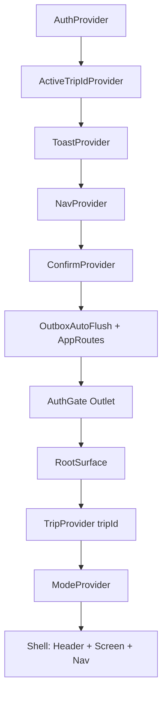

# Frontend Architecture Review

**Status:** REVIEW (advisory) · **Date:** 2026-07-18 · **Reviewer role:** senior frontend architect
**Scope:** `frontend/` (React PWA), with cross-checks into `packages/shared/` and `backend/` contracts and the `docs/` tree.
**Constraint honored:** no production code was modified. Only this document was added.

---

## 1. Executive summary

Waypoint's frontend is **unusually mature for its stage** and clearly built _for this product_, not from a generic React template. The core primitives the product depends on — trip-timezone "now/next", the hard/soft distinction, derived phases, offline read + optimistic write, one-slot undo, a single back model — are implemented as **small, pure, well-tested functions** in `src/lib` and `src/state`, with 341 passing unit tests including real DST-boundary and fake-IndexedDB coverage. Typecheck, production build, and the full test suite are green.

**Architectural maturity:** solid mid-stage. Responsibilities are mostly well separated (pure domain libs ← state providers ← screens), the shared zod-first contract is genuinely the source of truth, and the offline design is coherent rather than improvised.

**Strongest aspects**

- Rigorous **temporal correctness**: one clock seam (`getNow`/`useClock` + dev time-travel), `todayInTz` everywhere, no stored "now", a fixed-point DST resolver (`zonedIso`) with tests.
- A **coherent offline-first read/write stack**: snapshot → Dexie mirror → outbox with write-through → device-wide FIFO flush → `seq`-cursored catch-up, all with client-generated ids for idempotency.
- **Auth model discipline**: in-memory access token, httpOnly rotating refresh, coalesced refresh, cached identity (not credential) for cold offline boot.
- A **testable pure-function core** and a deliberately small dependency set.

**Most important weaknesses**

- **No teardown of local caches on logout / session expiry** — decrypted document blobs (passports, insurance) and full trip snapshots persist on the device and can be flushed/read under the next session. This is the headline risk.
- **Fixture leakage into production code paths** — a hardcoded `+09:00` offset and a hardcoded `activeUserId` reach real write verbs, producing wrong instants for non-Tokyo trips and wrong authorship.
- **Silent loss of offline writes** on a 4xx during flush, with no failed-sync surface, while the optimistic UI still reads as saved.

**Top three risks**

1. **Cross-session data isolation on shared devices** (Critical) — F-01.
2. **Wrong event times for any trip not in Asia/Tokyo** via the quick-schedule verb (High) — F-02.
3. **Silent data loss of a queued write with no user-visible sync failure** (High) — F-03.

**Production-readiness:** **Not yet, but close.** For the intended tiny private group the app is largely usable today, but F-01 (privacy of stored passports across logout), F-02 (a whole class of trips get wrong times), and F-03 (invisible data loss) are all reachable on the happy path and should be fixed before broader use. None require a rewrite; all are localized.

---

## 2. Scope and methodology

**What was reviewed (by reading source):**

- Entry/shell: `main.tsx`, `App.tsx`, `index.html`, `vite.config.ts`.
- State: `state/auth-state.tsx`, `active-trip-id.tsx`, `mode-state.tsx`, `nav-state.tsx`, `trip-state.tsx`, `verbs.ts`.
- Libs: `lib/api.ts`, `cache.ts`, `outbox.ts`, `doc-cache.ts`, `documents.ts`, `time.ts`, `useClock.ts`, `ws.ts`, `active-trip.ts`, `mode.ts`, `intent.ts`, `glance.ts` (partial), `fixtures.ts`, `db.ts`.
- Screens/UI: `Index.tsx`, `TripSettings.tsx`, `CreateTrip.tsx`, `JoinTrip.tsx`, `DocumentsSection.tsx`, `DocumentViewer.tsx`, `Sheet.tsx`, `Toast.tsx` (+ targeted reads of `Home.tsx`, `DayView.tsx`, `PlanDay.tsx`, `BookingSheet.tsx`).
- Shared: `packages/shared/src/entities.ts` (contract shapes).
- Build/CI: `package.json` (root + frontend), `turbo.json`, `.github/workflows/ci.yml`.

**Documentation consulted:** `CLAUDE.md`, `README.md`, `docs/INDEX.md`, `architecture/overview.md`, `architecture/sync-and-offline.md`, and the ADR router (with targeted reads of ADRs referenced inline: 0011, 0016, 0018–0022, 0033, 0035, 0039, 0040, 0042, 0045, 0047/0048, 0055–0058, 0060, 0062). Mockups were treated as design reference only, not as authority over shipped docs.

**Flows traced through code:** boot/auth resolution, create trip, join trip (incl. OAuth intent round-trip), active-trip resolution/switch, tab navigation + back model, event verbs (create/edit/delete/move/schedule/park + undo), booking create/edit/delete, document view online, document view offline (Cache-API read), offline write enqueue → cold reopen → reconnect flush, remote change fan-out, session expiry, and stale-cache-after-logout.

**Commands run:**

- `pnpm install --frozen-lockfile` — clean.
- `pnpm --filter @waypoint/frontend test` — **341 passed / 28 files**.
- `pnpm --filter @waypoint/frontend typecheck` — clean.
- `pnpm --filter @waypoint/frontend build` — succeeds; **one 620 KB JS chunk (185 KB gzip)**, chunk-size warning emitted.

**Not done / limitations:** The app was **not executed in a browser** — findings are inferred from code, contracts, and tests, not from runtime observation. No backend was booted; contract checks were static (frontend zod parse vs. `packages/shared`). RTL/visual/gesture behavior was read, not seen. CSS was sampled (`grep`), not fully audited. Coverage is **sampled**, not exhaustive: most `src/lib` and `src/state` were read in full; screens and `ui/` components were read selectively toward the highest-risk areas. Treat the absence of a finding in an un-read component as "not reviewed," not "clean."

---

## 3. Product and architecture model

**Product behavior the frontend supports.** A phone-first, RTL, offline-tolerant "trip control center" for ~5 people. It shows _now/next_ rather than a full itinerary, distinguishes hard commitments from soft plans, keeps a live shared trip state over WebSocket, and remains readable (and editable, queued) with no signal. Two modes (Plan / Trip) re-emphasize the same four tabs rather than adding screens.

**Route structure.** A single layout route (`AuthGate` via `<Outlet/>`) wraps everything:

- `/login`, `/trips` (all-trips), `/new` (create), `/join/:token` (public preview exempt from the anon gate), `/trip/:id/settings`, and `*` → `RootSurface` (the in-trip shell). The in-trip **tab lives in the URL query** (`?tab=`), Home-anchored, so platform back peels tabs (ADR-0035). Overlays (sheets/dialogs) register into an in-memory stack that back consults first.

**Provider hierarchy** (`App.tsx`):

`TripProvider` fetches the snapshot (or reads the Dexie cache offline), then `TripReady` owns the reducer (events/maybe) plus reactive lists (trip, members, bookings, places, documents), the WebSocket, reconnect catch-up, warm-resume resync, and the optimistic write verbs.

**API boundary.** All HTTP goes through `lib/api.ts` (`apiFetch` attaches the in-memory bearer + cookie, does one silent refresh on 401, validates every response with zod). Screens never `fetch` directly. Writes go through the **verbs** (`state/verbs.ts`, `trip-state` settings/index verbs) → `restOrQueue` → either the REST call or the outbox.

**Cache/IndexedDB boundary.** `db.ts` (Dexie v4): `events`, `bookings`, `documents` (summaries only), `snapshotMeta` (the rest of the snapshot), `outbox` (FIFO writes, may carry a `File`), `tripList`. Document **bytes** are a separate Cache-API store (`doc-cache.ts`), versioned by `updatedAt`. `cache.ts` keeps all of it coherent on snapshot/change/resync and write-through-on-enqueue.

**PWA boundary.** `vite-plugin-pwa` (Workbox `generateSW`, `autoUpdate`, `skipWaiting` + `clientsClaim`), precaching the app shell; `navigateFallbackDenylist` excludes backend routes.

**Shared contract usage.** `@waypoint/shared` (zod-first) is imported for every entity type and parsed at every API boundary — genuine single source of truth, kept next to `schema.prisma`.

**Main data/mutation flow.** Read: snapshot → reducer + reactive lists → screens; every fetch/change mirrors to Dexie. Write: verb applies optimistically (reducer/list) → `restOrQueue` → on success reconcile with the canonical entity; offline → outbox + write-through; on reconnect → flush (FIFO) → `changes?sinceSeq` catch-up → resubscribe. Remote WS `change` → fan-out into reducer + reactive lists + Dexie.

---

## 4. Offline capability assessment

Using precise terms, the implementation is:

| Classification                           | Verdict               | Evidence                                                                                                                                                                                                                                                                                                                                    |
| ---------------------------------------- | --------------------- | ------------------------------------------------------------------------------------------------------------------------------------------------------------------------------------------------------------------------------------------------------------------------------------------------------------------------------------------- |
| **Offline app-shell capable**            | **Yes**               | Workbox precache of the shell (`vite.config.ts`); `navigateFallbackDenylist` keeps backend routes on the network.                                                                                                                                                                                                                           |
| **Offline-readable**                     | **Yes**               | Whole-trip snapshot mirrored to Dexie on every fetch/change/resync (`cache.ts`), trip list mirrored (`loadTripList`), identity cached in `localStorage` (`auth-state`), document bytes cached via Cache API (`doc-cache.ts`). `TripProvider` falls back to the cached snapshot; boot resolves the active trip from the cached list.         |
| **Offline-tolerant**                     | **Yes**               | `useIsOffline` + `usingCachedSnapshot` drive an honest offline badge; server-only actions (create/join/invite) disable their controls offline with a note.                                                                                                                                                                                  |
| **Offline-editable** (shared data-plane) | **Yes, with caveats** | Timeline, maybe-shelf, trip settings/roster, bookings, places, document uploads all route through the outbox with write-through (`restOrQueue`, `applyOutboxOpToCache`). Client-generated ids make retries idempotent; an offline-created entity can reference another. **Caveat:** a hard-error (4xx) on flush is dropped silently (F-03). |
| **Eventually synchronized**              | **Yes, with caveats** | FIFO flush halts+retries on transient errors, device-wide flush on `online`/mount, `seq`-cursored catch-up + full-snapshot resync on gap/hello-ahead. **Caveats:** no WS-level reconnect/heartbeat (F-04); conflicts are LWW-only with no surfaced conflict/failed-sync state.                                                              |

**Cached data:** trip snapshot (events, bookings, document _summaries_, maybe-items, places, members, users, trip, `latestSeq`), trip list, last identity, document _bytes_ (Cache API, versioned).
**Uncached:** `fileRef` (never leaves the server), map tiles/nav, Gmail/calendar (by design, ADR-0004).
**Offline mutation behavior:** optimistic in-memory + Dexie write-through + outbox entry.
**Reconnection:** flush → catch-up → resubscribe on `online`, plus a warm-resume path on `visibilitychange` past 30 s.
**Conflict behavior:** row-level server LWW; undo appends an inverse change. No conflict surface in the UI.
**User-visible sync state:** offline badge + a pending-count badge; per-op toasts (with an honest "queued" wording). **Missing:** any indication that a queued write _failed permanently_ (F-03).
**Data-isolation guarantees:** **weak across sessions** — caches are not user/logout-scoped (F-01).

---

## 5. Findings

Ordered by severity. IDs are stable references.

### Critical

---

**F-01 — Local caches are not torn down on logout or session expiry (cross-session data leakage; decrypted passports persist)**

- **Severity:** Critical · **Confidence:** High (mechanism) / Medium (exploit severity) · **Category:** security / data-isolation
- **Files/symbols:** `state/auth-state.tsx` `logout`, `setOnSessionExpired` callback; `lib/cache.ts` `clearTripCache` (only called on trip delete); `lib/doc-cache.ts` (no logout hook); `state/active-trip-id.tsx` `ACTIVE_TRIP_STORAGE_KEY`; `db.ts` tables.
- **Observed behavior:** `logout()` calls `requestLogout()` + `setMe(null)` + `setStatus('anon')` + `clearCachedMe()`. Session expiry clears the token + cached `me`. **Neither clears** Dexie (`events`, `bookings`, `documents`, `snapshotMeta`, `tripList`, `outbox`), the Cache-API document blob store (`waypoint-doc-content-v1`), or `wp_active_trip_id`. `clearTripCache` runs only on explicit trip deletion.
- **Why it matters:** The app stores **decrypted document bytes** (passports, insurance, visas — `DOCUMENT_TYPE`) in `CacheStorage` and full trip snapshots in IndexedDB. After sign-out these remain on disk indefinitely, readable via DevTools or by the next person to use the device. Worse, `fetchDocumentContent` consults `readCachedBlob` **before** any auth check, so a cached blob is returned with no live authorization. And `OutboxAutoFlush` flushes **every** trip's queue whenever _any_ user is `authed` — a write queued by user A can be POSTed under user B's session on the next login.
- **Realistic failure scenario:** Two friends share one phone (or a device is returned/sold). User A views their passport scan, signs out. User B signs in (or opens DevTools) → user A's passport bytes and trip data are still present and served. Separately: A queues an offline edit, hands the phone to B who logs in online → A's edit flushes under B's session.
- **Evidence:** `grep` for cache-clearing shows `clearTripCache` invoked only from `trip-state` delete and `cache.ts` trip-delete change; `logout`/`onSessionExpired` clear nothing else; `api.ts fetchDocumentContent` reads cache before `apiFetch`.
- **Recommended change:** On logout **and** on a genuine (online 401) session-expiry, clear all Dexie tables, `caches.delete('waypoint-doc-content-v1')`, and `wp_active_trip_id`. Add a `wipeLocalData()` in `lib/cache.ts` (+ `doc-cache.ts` export) and call it from both auth paths. Optionally scope caches by a user key so a re-login can't read a prior user's rows even before the wipe completes. Do **not** wipe on the _offline_ cold-boot fallback (that path deliberately keeps the cache).
- **Scope:** Small–Medium · **Priority:** Immediate
- **Regression tests:** unit test that `wipeLocalData()` empties every table + the blob cache; test that logout invokes it; test that offline-fallback boot does **not**.

### High

---

**F-02 — Fixture timezone offset (`+09:00`) hardcoded in the quick-schedule verb → wrong instants for any non-Tokyo trip**

- **Severity:** High · **Confidence:** High · **Category:** correctness / temporal
- **Files/symbols:** `state/verbs.ts` `schedule` (lines ~601–606), importing `TRIP_TZ_OFFSET` from `fixtures.ts` (`'+09:00'`).
- **Observed behavior:** The Trip-mode one-tap "schedule this idea onto today" builds `startsAt`/`endsAt` as `` `${activeDate}T${DEFAULT_SCHEDULE_SLOT.START}:00${TRIP_TZ_OFFSET}` `` — i.e. it always stamps a **+09:00** offset regardless of `trip.timezone`.
- **Why it matters:** The codebase otherwise scrupulously uses `zonedIso(date, time, trip.timezone)` (`time.ts`). This one path bypasses it. For a Europe/London trip, "schedule at 09:00" is persisted as 09:00 **JST**, i.e. 00:00–01:00 London — the event lands ~8–9 hours off, breaking now/next, the glance rail, and the day it's filed under.
- **Realistic failure scenario:** On a Paris trip, a user taps a maybe-idea to schedule it for "now-ish today"; it appears at the wrong time (or on the adjacent day) for everyone.
- **Evidence:** `grep TRIP_TZ_OFFSET` shows production use in `verbs.ts` (and the noon-anchored header labels in `DayView.tsx`/`PlanDay.tsx`, which are far lower-risk because noon rarely crosses a date boundary regardless of offset).
- **Recommended change:** Replace the string interpolation with `zonedIso(activeDate, DEFAULT_SCHEDULE_SLOT.START, trip.timezone)` / `.END`. Remove `TRIP_TZ_OFFSET` from all non-fixture imports; consider moving `fixtures.ts` out of the production import graph entirely (see F-05).
- **Scope:** Small · **Priority:** Immediate
- **Regression tests:** schedule-verb test asserting the produced `startsAt` equals `zonedIso` for a non-`Asia/Tokyo` trip (e.g. `Europe/London`, `America/New_York`), including a DST-active date.

---

**F-03 — Offline writes that hard-fail on flush are dropped silently, with no failed-sync surface**

- **Severity:** High · **Confidence:** High · **Category:** offline / data-loss / UX
- **Files/symbols:** `lib/outbox.ts` `doFlushOutbox` (4xx branch: `db.outbox.delete` + `setPendingCount` + `continue`, no notification).
- **Observed behavior:** A queued op that returns 4xx on flush is deleted from the outbox and the flush continues. This is correct for the _documented_ case (a stale `MOVE_INTO_PAST`), but it is applied to **every** 4xx for **every** verb — including a booking/place/create/update rejected by validation, permission, or a hard-event 409. The optimistic entity remains in memory **and** in the Dexie cache (write-through happened at enqueue), so the pending badge clears and the change _looks saved_ until the next full snapshot resync silently removes it.
- **Why it matters:** This is the review's "UI shows success before the backend actually succeeded" case. The user gets no toast, no "failed to sync" marker, no chance to retry or recover — the change simply evaporates later. For a shared trip, edits vanish with no explanation.
- **Realistic failure scenario:** Offline, a peer adds a restaurant booking; connectivity returns; the server rejects it (e.g. a validation rule or a since-revoked membership) → the booking disappears at the next resync with no message.
- **Evidence:** `doFlushOutbox` drops on `err.status in [400,500)`; nothing marks the entity failed; `applyOutboxOpToCache` already persisted it; only `RESYNC` (full snapshot) reconciles the reactive lists.
- **Recommended change:** Distinguish "known-unfixable and safe to drop" (a small allowlist, e.g. `MOVE_INTO_PAST`/`MOVE_CROSSES_DAY`) from other 4xx. For the rest, surface a persistent failed-sync state (a toast + a "couldn't sync N changes" affordance) and roll back the optimistic cache entry, or move the entry to a dead-letter list the user can review. At minimum, toast on every non-allowlisted drop.
- **Scope:** Medium · **Priority:** Immediate–Near term
- **Regression tests:** flush test where a `createBooking` op 4xxs → assert a failure is surfaced and the optimistic row is reconciled/removed, not silently retained; separate test that `MOVE_INTO_PAST` still drops quietly.

---

**F-04 — No WebSocket-level reconnect or heartbeat; a foreground socket drop goes undetected**

- **Severity:** High · **Confidence:** Medium–High · **Category:** sync / realtime
- **Files/symbols:** `lib/ws.ts` `openTripStream` (no `onclose`/`onerror`, no `ping`); reconnect is driven only by `window 'online'` and `visibilitychange` in `trip-state.tsx`.
- **Observed behavior:** The client opens the socket and listens for `message` only. Reconnect/catch-up runs on an `online` transition or a >30 s visibility resume. There is **no** handler for the socket closing while the tab is foregrounded and the network never "flapped" (a proxy/idle timeout, a server restart, a transient drop). The client also never sends the `ping` the protocol allows, so idle intermediaries may cull the connection.
- **Why it matters:** The product's core pillar is "everyone sees the same trip, live." When the socket dies silently the app keeps rendering stale shared state indefinitely with **no indication**, until an unrelated `online`/visibility event happens to trigger catch-up. There is no gap detection if no frames arrive at all.
- **Realistic failure scenario:** Two members on stable Wi-Fi; a load balancer idles out the WS after N minutes. Member A edits; member B never sees it (and shows no offline badge) until B backgrounds/foregrounds the app.
- **Evidence:** `ws.ts` returns `() => ws.close()` and wires only `message`; `trip-state`'s effect adds listeners for `online`/`visibilitychange` but nothing bridges `ws.onclose` back to `connect()`.
- **Recommended change:** In `openTripStream`, handle `onclose`/`onerror` with a bounded exponential-backoff reconnect that re-runs catch-up via the handlers, and add a periodic client `ping` with a server-`pong`/timeout watchdog. Expose a "reconnecting" state so the chrome can show it.
- **Scope:** Medium · **Priority:** Near term
- **Regression tests:** a `ws` unit test simulating `onclose` → asserts a reconnect/catch-up is scheduled; heartbeat-timeout triggers a resync.

### Medium

---

**F-05 — Fixture identity/attribution (`activeUserId = 'u-assaf'`) leaks into optimistic writes**

- **Severity:** Medium · **Confidence:** High · **Category:** correctness / architecture
- **Files/symbols:** `fixtures.ts` `activeUserId`; consumed in `state/verbs.ts` (event/maybe/park `createdBy`/`updatedBy`), `state/trip-state.tsx` `indexVerbs` (booking/place `updatedBy`), `ui/EventForm.tsx`. Also `TripContext` re-exports `activeUserId` and `glance: GLANCE` (dead fixtures on the live context).
- **Observed behavior:** Every optimistic create/update stamps `createdBy`/`updatedBy` with the fixture user `u-assaf`, never the real signed-in user (`me.user.id`). Server-reconciled entities (events) self-correct on the canonical response; **non-reconciled** ones (maybe-items with client ids; bookings/places while offline) keep the wrong author until a full resync.
- **Why it matters:** "Who added this" is wrong for the local actor until resync — misleading in a collaborative trip, and a latent trap if any future gating ever reads context `activeUserId` (which is the fixture, not `me`). It also signals fixture code is still on the production import graph (see F-02).
- **Realistic failure scenario:** נועם adds a shelf idea offline; teammates (and נועם's own view, pre-resync) see it attributed to אסף.
- **Evidence:** `grep activeUserId` shows only fixture-sourced usage in write paths; no screen reads it for authorization (auth gating correctly uses `me` — see Positives), so impact is attribution, not access.
- **Recommended change:** Source `createdBy`/`updatedBy` from `useAuth().me.user.id` (thread it through the verbs/`indexVerbs`). Delete `activeUserId` and `glance` from `TripContext`. Move `fixtures.ts` behind a dev-only entry so it can't be imported by shipped code.
- **Scope:** Small–Medium · **Priority:** Near term
- **Regression tests:** verb test asserting optimistic `updatedBy === me.id`; lint/import rule that production modules don't import `fixtures`.

---

**F-06 — `activeDate` clamps against the snapshot's original trip dates, not the live trip**

- **Severity:** Medium · **Confidence:** Medium · **Category:** state consistency / correctness
- **Files/symbols:** `state/trip-state.tsx` `TripReady` — `const { startDate, endDate } = snapshot.trip;` captured once; `setActiveDate` clamps to those consts, while the day strip (`App.tsx Header`) is built from the **reactive** `trip`.
- **Observed behavior:** When an admin edits trip dates live (a data-plane change updates `trip` state), the day-strip renders new/removed day pills from the reactive `trip`, but `setActiveDate`'s clamp still uses the **stale** snapshot bounds. Tapping a newly-added day clamps it back to the old max; if dates shrank, `activeDate` may point outside the new range.
- **Why it matters:** Post-edit, the header and the selectable range disagree — a day you can see you can't select (or vice versa).
- **Realistic failure scenario:** Admin extends the trip by two days mid-trip; a member taps the new last day and the view snaps back to the old last day.
- **Evidence:** the destructure at TripReady top vs. `setActiveDate` closing over it; `Header`'s `days` array derives from `trip` (reactive).
- **Recommended change:** Clamp against the current reactive `trip.startDate/endDate` (read at call time), not the captured snapshot consts.
- **Scope:** Small · **Priority:** Near term
- **Regression tests:** a state test where trip dates change after mount → `setActiveDate` accepts a date in the new range.

---

**F-07 — No route-level code splitting: a single ~620 KB (185 KB gzip) JS bundle**

- **Severity:** Medium · **Confidence:** High · **Category:** performance
- **Files/symbols:** build output `dist/assets/index-*.js` 620.55 KB; no `React.lazy`/dynamic `import()` in `App.tsx` routing.
- **Observed behavior:** Every screen, the pinch-zoom `DocumentViewer`, all libs and Dexie load up front in one chunk; the build emits the >500 KB warning.
- **Why it matters:** The product's target situation is _weak connectivity abroad_. First load / first PWA install cost is paid entirely up front, on exactly the network where it hurts. (Silver lining: because there is only one chunk, the `skipWaiting` SW swap does not currently risk a lazy-chunk-hash mismatch — but that also disappears the moment splitting is added, see F-13.)
- **Evidence:** `vite build` output; router imports all screens statically.
- **Recommended change:** Lazy-load the heavier, non-first-paint surfaces (`DocumentViewer` + zoom math, `TripSettings`, `PlanDay`/builder, `CreateTrip`) with `React.lazy` + `Suspense`. Keep the boot path (auth, RootSurface, Home) eager.
- **Scope:** Medium · **Priority:** Near term
- **Regression tests:** n/a (build-size budget check in CI is the durable guard).

---

**F-08 — Modals/sheets lack focus management and an Escape affordance**

- **Severity:** Medium · **Confidence:** High · **Category:** accessibility
- **Files/symbols:** `ui/Sheet.tsx`, `ui/ConfirmDialog.tsx`, `screens/TripSettings.tsx` `Confirm`, `ui/DocumentViewer.tsx`, `ui/BookingSheet.tsx` (`role="dialog"`/`aria-modal` set, but no focus handling).
- **Observed behavior:** Dialogs set `role`/`aria-modal`/`aria-label` correctly but do not move focus into the dialog on open, do not trap Tab within it, do not restore focus on close, and offer no `Escape` key handler (dismissal is tap-outside / back-gesture / system-back only).
- **Why it matters:** Keyboard and screen-reader users can Tab into the page behind an "modal" dialog, and there's no keyboard close. Mobile-first mitigates this (the back gesture covers touch), but it's a real WCAG 2.1.2/2.4.3 gap for the desktop "graceful minimum" (ADR-0017).
- **Evidence:** the components render the dialog markup with no `useEffect` focus logic or `keydown` handler.
- **Recommended change:** A small shared `useDialogFocus(ref)` hook: focus the dialog (or first focusable) on mount, trap Tab, restore focus on unmount, and close on `Escape` (routing through the same overlay-close path as the back gesture).
- **Scope:** Medium · **Priority:** Near term
- **Regression tests:** with a jsdom test env (not yet present — see §9), assert focus moves in, Tab cycles, Escape closes.

---

**F-09 — App-wide zoom disabled (`user-scalable=no`, `maximum-scale=1`)**

- **Severity:** Medium · **Confidence:** High · **Category:** accessibility (documented tradeoff)
- **Files/symbols:** `index.html` viewport meta + the gesture-suppression script; ADR-0062.
- **Observed behavior:** Pinch-zoom is suppressed everywhere except the image preview; the viewport meta blocks user scaling.
- **Why it matters:** WCAG 1.4.4 (Resize Text) — low-vision users can't magnify the UI. This is an **explicit product decision** (ADR-0062), noted here for completeness and because it may bite if the app broadens beyond the private group. Not a bug.
- **Recommended change:** Revisit if accessibility scope widens; browser text-scaling via relative units is a partial mitigation. Keep as a conscious tradeoff otherwise.
- **Scope:** n/a · **Priority:** Longer term (revisit)

---

**F-10 — Dynamic offline/sync status is not announced to assistive tech**

- **Severity:** Medium · **Confidence:** Medium · **Category:** accessibility
- **Files/symbols:** `App.tsx Header` offline + pending-sync badges (plain `div`s, no `aria-live`); `TripSettings.tsx` same. (`Toast.tsx` **does** use `role="status" aria-live="polite"` — good.)
- **Observed behavior:** Going offline / accumulating pending writes updates visual badges only; screen-reader users get no announcement of connectivity or unsynced-change state.
- **Why it matters:** For an offline-first app, connectivity/sync state is meaningful status a blind user needs.
- **Recommended change:** Wrap the offline + pending-sync badges in a polite live region (or render them through the existing toast/live-region pattern on transition).
- **Scope:** Small · **Priority:** Near term

### Low / Informational

---

**F-11 — Fonts loaded from an external CDN (Google Fonts)** · Low · `index.html` `<link href="fonts.googleapis.com …">`. Not precached by the SW, so first offline paint uses fallback fonts; also an external-origin/privacy dependency at odds with the single-origin posture. _Recommend:_ self-host + precache the woff2 subset.

**F-12 — `flushOutbox` coalescing can defer writes enqueued during an in-flight flush** · Low · `lib/outbox.ts` `flushOutbox`/`doFlushOutbox` read the queue once at start; an op enqueued mid-flush (e.g. `queueDocumentUpload` kicking a flush while one is running) returns the _existing_ promise and isn't drained until the next `online`/visibility/mount trigger. _Recommend:_ re-check for new entries after a flush completes, or loop until the queue is empty.

**F-13 — SW `skipWaiting` + `clientsClaim` + `autoUpdate` with no update prompt** · Low (today) · `vite.config.ts`. A new SW activates and claims clients mid-session; harmless now (single eager bundle) but becomes a lazy-chunk-mismatch hazard the moment F-07 (code-splitting) lands. _Recommend:_ pair a "new version — reload" prompt (or `registerType: 'prompt'`) with code-splitting.

**F-14 — `crypto.randomUUID()` requires a secure context** · Low · `verbs.ts`, `trip-state.tsx indexVerbs`. Fine in prod (HTTPS) and on `localhost`, but breaks id generation on a plain-HTTP LAN test host. _Recommend:_ a tiny fallback, or document the constraint.

**F-15 — `pendingCount` can transiently drift under concurrent device-wide flush** · Informational · `outbox.ts` uses a module-global counter mutated across interleaved async flushes; re-primed by `initOutboxCount` on reload, so it self-heals. _Recommend:_ derive the count from `db.outbox.count()` after each flush rather than incrementing a shared global.

---

## 6. Positive findings (preserve these)

- **Temporal correctness is a genuine strength.** `getNow`/`useClock` is the single clock seam with dev time-travel; `todayInTz` is used consistently; `zonedIso` resolves DST by fixed-point iteration with real-boundary tests; no `now` is ever stored (ADR-0018/0026). `time.test.ts` pins now/next and countdown. _(F-02 is the one lapse — everything else is disciplined.)_
- **Offline read/write architecture is coherent, not ad hoc.** Snapshot mirror + `snapshotMeta` remainder + write-through-on-enqueue + device-wide FIFO flush + client-id idempotency + `seq`-cursored catch-up, all matching `sync-and-offline.md`. Backed by `cache.test.ts`/`outbox.test.ts` on `fake-indexeddb`.
- **Auth model is careful.** In-memory access token (never `localStorage`), coalesced single-flight refresh (avoids the rotating-token race), refresh-before-`/me` to beat the `DEV_AUTH` stub, cached identity treated explicitly as identity-not-credential for offline boot.
- **Authorization is backend-owned; frontend gating is UI-only.** `TripSettings` derives `isAdmin` from the real `me` + membership and the doc is explicit that the server enforces (ADR-0039). Correct division.
- **The single back model (`nav-state.tsx`) is well-factored and tested.** Pure `tabStep`/`structuralBackStep`/`systemBackDecision` decision functions, one overlay stack, Navigation-API interception with a Safari fallback — unit-tested without a DOM.
- **Document handling is safe.** Object URLs are revoked on cleanup, undecodable images (HEIC) fall back to open/download instead of a blank embed, external links use `rel="noopener noreferrer"`, blobs are versioned by `updatedAt` and evicted on peer replace.
- **RTL is done at the data level, not just `dir="rtl"`.** Logical CSS (`insetInlineStart`), `dir="ltr"` islands for codes/dates/emails, `NavArrow` mirrors by direction, Hebrew never set in mono per the design language.
- **Deliberately small dependency set** (React, router, Dexie, PWA plugin) and a zod-first shared contract parsed at every boundary — exactly the "small but not painted into a corner" tenet.
- **CI is thorough:** frozen-lockfile install, prisma migrate/seed, typecheck, build, test, lint, `format:check` — all the gates the review asks for.

---

## 7. State and data-ownership matrix

| State / entity             | Authoritative source                     | In-memory owner                                    | Persisted location                               | URL representation                 | Update mechanism                                  | Invalidation / reset                | Main risks                                           |
| -------------------------- | ---------------------------------------- | -------------------------------------------------- | ------------------------------------------------ | ---------------------------------- | ------------------------------------------------- | ----------------------------------- | ---------------------------------------------------- |
| Auth status / access token | Backend (JWT + refresh cookie)           | `AuthProvider` state; token in `api.ts` module var | Refresh cookie (httpOnly); token **memory only** | —                                  | boot refresh→`/me`; 401 silent refresh; logout    | `onSessionExpired`, `logout`        | **Caches not cleared on logout (F-01)**              |
| Current user identity      | Backend `/me`                            | `AuthProvider.me`                                  | `localStorage` (`wp_me`, identity only)          | —                                  | `fetchMe`; cached fallback offline                | `clearCachedMe` on real 401/logout  | Stale identity offline is by design                  |
| Active trip id             | Client (per-device, ADR-0021)            | `ActiveTripIdProvider`                             | `localStorage` (`wp_active_trip_id`)             | via route `RootSurface` resolution | `setTripId` on pick/create/join                   | **Never reset on logout (F-01)**    | Stale id survives user switch                        |
| Trip collection            | Backend `/trips`                         | `RootSurface`/`AllTrips` local state               | Dexie `tripList`                                 | `/trips`                           | `loadTripList` (cache fallback)                   | `cacheTripList` clear+put           | Fine                                                 |
| Current trip               | Backend snapshot                         | `TripReady.trip` (reactive)                        | Dexie `snapshotMeta.trip`                        | `*`/`?tab=`                        | snapshot + WS `trip` changes + settings verbs     | re-seed on trip switch              | `activeDate` clamp uses stale bounds (F-06)          |
| Members / roster           | Backend                                  | `TripReady.members`                                | Dexie `snapshotMeta.members`                     | —                                  | snapshot + WS `membership` + verbs                | re-seed on switch                   | Fine                                                 |
| Events (timeline)          | Backend                                  | `TripReady` reducer                                | Dexie `events`                                   | —                                  | verbs (optimistic) + WS + resync                  | reducer re-init on switch           | 4xx flush drop (F-03)                                |
| Maybe-shelf                | Backend                                  | reducer                                            | Dexie `snapshotMeta.maybeItems`                  | —                                  | verbs + WS + resync                               | re-init on switch                   | Fixture author (F-05)                                |
| Bookings                   | Backend                                  | `TripReady.bookings`                               | Dexie `bookings`                                 | `?booking=` deep-link              | `indexVerbs` + WS + resync                        | re-seed on switch                   | 4xx flush drop (F-03); fixture author (F-05)         |
| Places                     | Backend                                  | `TripReady.places`                                 | Dexie `snapshotMeta.places`                      | —                                  | `indexVerbs` + WS + resync                        | re-seed on switch                   | Fixture author (F-05)                                |
| Documents (metadata)       | Backend (in snapshot, ADR-0058)          | `TripReady.documents`                              | Dexie `documents` (summaries)                    | `?focus=docs`                      | snapshot + WS `document` + uploads                | re-seed; blob evict on peer replace | Fine                                                 |
| Document bytes             | Backend `/content` (encrypted at rest)   | ephemeral object URL                               | Cache API `waypoint-doc-content-v1`              | —                                  | read-through + version key                        | evict on replace/delete             | **Not cleared on logout (F-01)**                     |
| Pending mutations          | Client                                   | `outbox.ts` module count + Dexie                   | Dexie `outbox`                                   | —                                  | `enqueueOutbox`/flush                             | delete on success/4xx-drop          | Silent drop (F-03); flushed under any session (F-01) |
| Navigation mode            | Derived (dates+clock) + session override | `ModeProvider`                                     | none (memory)                                    | —                                  | `tripPhase` + `setOverride`                       | reset on trip switch/reload         | Correct by design                                    |
| Selected day               | Client                                   | `TripReady.activeDate`                             | none                                             | none (not in URL)                  | `setActiveDate`; Home resets to today (Trip mode) | idle-resume reset                   | Not deep-linkable; stale clamp (F-06)                |
| In-trip tab                | URL                                      | `useSearchParams`                                  | none                                             | `?tab=`                            | `goToTab`/`tabStep`                               | back peels                          | Good                                                 |
| Overlay stack              | Client                                   | `NavProvider` refs                                 | none                                             | none                               | register/close                                    | `closeAllOverlays` on idle-resume   | Overlays not URL-addressable (intended)              |

---

## 8. User-flow risk matrix

| Flow                             | Happy path                        | Offline                              | Failure recovery                   | Test coverage                                | Main risks                                             |
| -------------------------------- | --------------------------------- | ------------------------------------ | ---------------------------------- | -------------------------------------------- | ------------------------------------------------------ |
| Open + authenticate              | ✅ solid                          | ✅ cached identity renders signed-in | ✅ 401→refresh→anon                | Partial (no auth-lifecycle integration test) | Caches survive across users (F-01)                     |
| Create trip                      | ✅                                | ⛔ disabled offline (by design)      | ✅ error kept on screen            | `trip-name` only                             | —                                                      |
| Join trip                        | ✅ incl. OAuth intent round-trip  | ⛔ disabled offline                  | ✅ retryable, idempotent           | `intent` unit                                | Preview trust (backend-owned)                          |
| Open/switch active trip          | ✅ resolveLanding tested          | ✅ cached snapshot fallback          | ✅ boot-error last resort          | `active-trip` ✅                             | Deleted/inaccessible trip → leaves to /trips (handled) |
| Navigate Home/Plan/Day           | ✅ URL tab + back model           | ✅ reads from cache                  | ✅                                 | `nav-state` ✅                               | Selected day not in URL (refresh loses it)             |
| Create/edit booking or event     | ✅ optimistic + reconcile         | ✅ outbox + write-through            | ⚠️ 4xx dropped silently (F-03)     | `verbs`, `booking-edit`, `index-bookings` ✅ | Data loss (F-03); wrong tz on quick-schedule (F-02)    |
| Open document online             | ✅ blob→object URL, HEIC fallback | n/a                                  | ✅ error message                   | `documents` (grouping)                       | —                                                      |
| Open cached document offline     | ✅ Cache-API read-through         | ✅ core capability                   | ✅ falls to error msg              | none for `doc-cache`                         | Blob persists post-logout (F-01)                       |
| Edit during weak/no connectivity | ✅ queue + honest "queued" toast  | ✅                                   | ⚠️ silent drop on later 4xx (F-03) | `outbox` ✅                                  | F-03                                                   |
| Peer changes shared info         | ✅ WS fan-out to lists+cache      | ✅ catch-up on reconnect             | ⚠️ no WS-drop detection (F-04)     | `ws` (gap logic) ✅                          | Silent staleness (F-04)                                |
| Auth expires mid-request         | ✅ one silent refresh then anon   | ✅ offline keeps identity            | ✅                                 | none (integration)                           | Caches not wiped on expiry (F-01)                      |
| Cached data from prior user/trip | ⚠️                                | ⚠️                                   | ⛔ no teardown                     | none                                         | **F-01**                                               |

---

## 9. Testing assessment

**Existing strengths.** 341 tests across 28 files, all green, covering the highest-value pure logic: `time`/`useClock` (incl. DST), `glance`, `gaps`, `day-entries`, `hero-booking`, `index-bookings`, `reorder`, `mode`, `active-trip`, `hebrew`, `money`, `trip-name`, `readiness`, `intent`, `nav-state` decision functions, `ws` gap logic, `verbs`/`trip-state` reducer + apply-fns, and `cache`/`outbox` on `fake-indexeddb`. Tests assert behavior (not implementation), use realistic entities, control time via the clock seam, and exercise IndexedDB for real.

**Most important gaps (ordered by product risk):**

1. **Cross-session isolation** — no test that logout/expiry wipes Dexie + blob cache + active-trip id (would have caught F-01). _Add first, alongside the fix._
2. **Offline write failure semantics** — no test that a non-`MOVE_INTO_PAST` 4xx surfaces failure instead of vanishing (F-03).
3. **Timezone coverage beyond Asia/Tokyo** — the quick-schedule path (F-02) and any date-only-vs-instant handling need a non-JST + DST matrix.
4. **WS lifecycle** — reconnect/heartbeat behavior on `onclose` (F-04) is untested.
5. **No component/integration layer at all** — `frontend` has no jsdom / Testing-Library dependency, so `AuthGate`, `TripProvider`/`TripReady` effects, routing, forms, and dialog a11y are entirely unverified at the render level.

**Fragile/misleading tests:** none observed; the suite is honest. The main risk is _false confidence from breadth_ — unit coverage is excellent but there is zero rendered-flow coverage, so regressions in provider wiring/effects/routing won't be caught.

**Recommended additions**

- _Unit:_ schedule-verb tz test (F-02); outbox 4xx-surface test (F-03); `setActiveDate` post-date-edit clamp (F-06); `wipeLocalData` (F-01); `ws` reconnect (F-04).
- _Integration (introduce jsdom + @testing-library/react):_ AuthGate anon→login→intent-resume; TripProvider online→offline snapshot fallback; a create/edit form round-trip; dialog focus-trap/Escape (F-08).
- _E2E (later, Playwright — Chromium is preinstalled):_ the twelve traced flows, especially offline-edit → reconnect → sync, and logout → next-login isolation.
- _Offline/timezone matrix:_ {online, offline-read, offline-write→reconnect} × {Asia/Tokyo, Europe/London (DST), America/New_York, UTC} × {cross-midnight, all-day, equal-start}.

---

## 10. Prioritized remediation plan

**Immediate (security / data-loss / core correctness)**

1. **F-01** — wipe all local caches (Dexie + Cache-API blobs + active-trip id) on logout and on genuine session expiry; add the isolation test. _(Blocks broader use.)_
2. **F-02** — replace the fixture `+09:00` with `zonedIso(..., trip.timezone)` in the schedule verb; add the non-JST tz test.
3. **F-03** — stop silently dropping non-allowlisted 4xx on flush; surface a failed-sync state and reconcile the optimistic cache.

**Near term (before significant feature growth)** 4. **F-04** — WS reconnect + heartbeat. 5. **F-05** — thread real `me.id` into write attribution; remove `fixtures` (and dead `glance`/`activeUserId` context) from the production import graph. _(Do alongside F-02 — same fixture root cause.)_ 6. **F-06** — clamp `activeDate` against the reactive trip. 7. **F-07** — route-level code splitting for heavy/non-first-paint surfaces. 8. **F-08 / F-10** — shared dialog focus hook; live-region for offline/sync status. 9. Introduce a **jsdom + Testing-Library** integration layer (enables F-08 tests and provider/routing coverage).

**Longer term (justified by real pressure)** 10. Pair an **SW update prompt** with code-splitting (F-13). 11. Revisit **zoom/accessibility** posture (F-09) if the audience widens. 12. A **conflict/failed-sync review surface** (dead-letter list) if multi-editor churn grows beyond LWW comfort.

**Optional cleanup**

- Self-host fonts (F-11); flush-loop for mid-flush enqueues (F-12); `randomUUID` fallback (F-14); derive `pendingCount` from the store (F-15).

**Dependencies between items:** F-02 and F-05 share the fixture root cause — do together. F-08 tests depend on the jsdom layer (#9). F-13 only matters once F-07 lands. No item requires a rewrite; all are localized.

---

## 11. Quick wins

- **F-02** one-line fix (swap the interpolation for `zonedIso`) + one test — removes a whole class of wrong-time bugs.
- **F-06** clamp against reactive trip dates — a few characters.
- **F-10** wrap two status badges in an `aria-live` region.
- **F-11** self-host the font subset (drops an external dependency and fixes offline first-paint).
- Delete the dead `glance: GLANCE` / `activeUserId` from `TripContext` (removes a fixture-wiring trap).
- Add a CI **bundle-size budget** so F-07 doesn't silently regress further.

---

## 12. Open questions and assumptions

These need product/backend/architecture input — they are **not** logged as frontend defects:

1. **Shared-device expectations.** Is a single device ever shared by non-members (borrowed, sold, family)? The answer sets how aggressive F-01's teardown must be (wipe-on-logout vs. also encrypt-at-rest client-side). _Assumption used:_ passports/insurance warrant wipe-on-logout regardless.
2. **Failed-sync UX.** When a queued write is permanently rejected, should the app toast-and-drop, keep a retry/dead-letter list, or roll back visibly? (F-03 recommends _at least_ surfacing it.)
3. **Conflict policy sufficiency.** Is row-level LWW with one-slot undo acceptable indefinitely at 5 users, or is a lightweight "someone else changed this" surface wanted? (Docs say LWW is intentional; confirming it's still the intent.)
4. **Selected day in the URL.** Should the active day be deep-linkable / refresh-surviving (a route param) rather than in-memory? Trade-off: shareable day links vs. the current Home-anchored back model.
5. **Timezone auto-derivation.** Creation uses the _device_ timezone and settings offers a small manual list (both documented deferrals). Fine to leave until the destination→tz picker lands?
6. **Zoom/accessibility scope.** ADR-0062 disables zoom app-wide; is WCAG 1.4.4 explicitly out of scope for the private-group v1 (F-09)?
7. **Backend contract confirmations (assumed true from `packages/shared`, not verified against a running server):** the server ignores client-sent `createdBy`/`updatedBy` and stamps its own; re-POST of a client-id create is treated as already-applied; the snapshot always includes `documents`/`places`. If any differs, F-05's blast radius changes.
